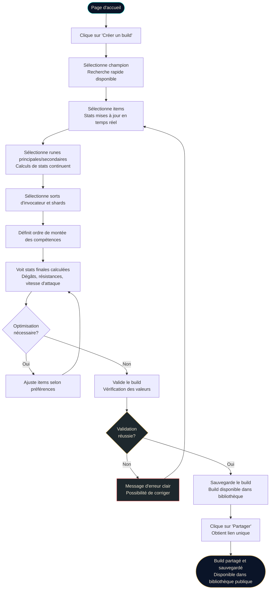
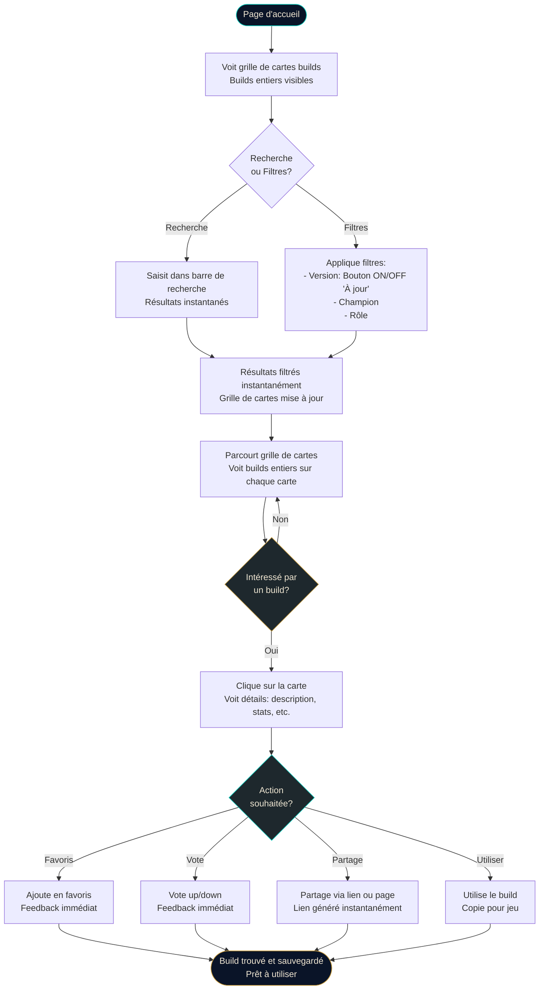

# UX Design Specification Lelanation_v2

**Author:** Darkaine
**Date:** 2026-01-14

---

<!-- UX design content will be appended sequentially through collaborative workflow steps -->

## Executive Summary

### Project Vision

**Lelanation v2** est une refonte complète de la plateforme de builds League of Legends, transformant une SPA en MPA (avec Nuxt 3) pour améliorer le SEO et offrir une expérience utilisateur optimale. La plateforme permet aux joueurs de créer, optimiser et partager des builds avec des calculs de statistiques en temps réel.

**Vision :** Devenir la plateforme de référence en français pour tous les outils League of Legends, rassemblant theorycraft, statistiques, builds et guides dans une interface unifiée.

**Différenciateur clé :** Plateforme de référence en français combinant créateur de builds, outil de theorycraft, et statistiques au même endroit, avec partage facilité et synchronisation automatique des données de jeu.

**Approche MVP :** Experience MVP - offrir une expérience complète dès le lancement avec au moins autant de fonctionnalités que la v1, une UX améliorée et sans bugs.

### Target Users

**Utilisateurs primaires :**
- **Communauté Lelariva** : Communauté existante avec attentes élevées
- **Joueurs francophones de League of Legends** : Casual et compétitifs
- **Profils :** Joueurs qui cherchent des builds optimisés, veulent créer leurs propres builds, ou analysent des statistiques

**Besoins utilisateurs :**
- **Trouver un build** : Localiser un build existant qui correspond à leurs besoins en moins de 3 minutes
- **Créer un build** : Créer un build complet et fonctionnel en moins de 3 minutes
- **Partager facilement** : Partager leurs builds avec la communauté en un seul clic
- **Optimiser** : Utiliser l'outil de theorycraft pour optimiser leurs builds

**Moment "aha!" :** Utilisateur crée, optimise et partage un build complet en moins de 3 minutes avec données à jour et outil de theorycraft fonctionnel.

**Contexte d'utilisation :**
- Avant une partie : Recherche rapide de builds
- Pendant la préparation : Création/optimisation de builds
- Analyse post-partie : Consultation de statistiques et comparaisons
- Partage communautaire : Partage de builds avec la communauté

### Key Design Challenges

**1. Migration SPA → MPA (Nuxt 3)**
- Maintenir une expérience fluide malgré le changement d'architecture
- Transitions entre pages naturelles et rapides
- Éviter la sensation de "rechargement" entre les pages
- Conserver l'état utilisateur entre les pages (builds en cours, préférences)

**2. Performance et Réactivité**
- Calculs de statistiques en temps réel < 500ms
- Latence perçue < 100ms pour les interactions
- Feedback visuel immédiat lors de la modification d'un build
- Optimisation pour mobile (performance within 10% de desktop)

**3. Complexité Fonctionnelle Simplifiée**
- 70 FRs organisés en 9 domaines fonctionnels à rendre accessibles
- Interface sobre et minimaliste malgré la complexité fonctionnelle
- Hiérarchie visuelle claire pour guider l'utilisateur
- Éviter la surcharge visuelle tout en gardant toutes les fonctionnalités

**4. Accessibilité et Mobile-First**
- Conformité WCAG 2.1 Level AA
- Navigation clavier complète
- Support lecteurs d'écran
- Touch targets ≥ 44x44px
- Performance mobile équivalente à desktop

**5. Correction des Problèmes v1**
- Bugs de synchronisation backend/frontend
- Bugs graphiques et UI
- Problèmes d'optimisation
- Amélioration générale de la stabilité

### Design Opportunities

**1. Design Sobre et Minimaliste**
- **Inspiration :** Design de League of Legends et shyv.net
- **Principe :** Chaque élément visible doit avoir un intérêt, pas de fioritures décoratives
- **Palette réduite :** Couleurs sobres, typographie claire, espacement généreux
- **Hiérarchie visuelle forte :** Éléments bien séparés, infobulles claires, interactions évidentes

**2. Expérience de Création Rapide**
- Workflow optimisé pour créer un build en < 3 minutes
- Interface épurée qui guide l'utilisateur sans le surcharger
- Feedback visuel immédiat lors de la sélection d'items/runes
- Calculs de stats en temps réel sans surcharger l'interface

**3. Partage Simplifié**
- Partage en un clic avec liens uniques
- Interface de partage minimaliste et claire
- Visualisation des builds partagés optimisée

**4. Découverte Intuitive**
- Recherche et filtrage efficaces sans surcharge visuelle
- Présentation claire des builds (cartes sobres, informations essentielles)
- Navigation fluide entre les différentes sections

**5. Design System Cohérent**
- Design system inspiré de League of Legends (cohérence visuelle)
- Composants réutilisables et cohérents
- Patterns d'interaction prévisibles et intuitifs

### Design Philosophy

**Principes de Design :**
- **Sobre et Minimaliste** : Chaque élément visible a un intérêt, pas de décorations inutiles
- **Inspiration League of Legends** : Design cohérent avec l'univers du jeu
- **Référence shyv.net** : Interface épurée et fonctionnelle
- **Performance First** : Design qui ne compromet pas la performance
- **Accessibilité** : Design inclusif (WCAG AA)
- **Mobile-First** : Design pensé d'abord pour mobile, puis adapté au desktop

## Core User Experience

### Defining Experience

**Action utilisateur principale : Trouver un build existant**

L'expérience centrale de Lelanation_v2 est centrée sur la **découverte rapide et pertinente de builds existants**. Cette action est la plus fréquente et la plus critique à bien faire. L'interface doit permettre aux utilisateurs de localiser un build qui correspond exactement à leurs besoins en moins de 3 minutes, avec une recherche et un filtrage instantanés.

**Boucle d'expérience centrale :**
1. **Recherche** : L'utilisateur arrive sur la plateforme avec un besoin spécifique (champion, rôle, style de jeu)
2. **Découverte** : Recherche/filtrage instantané pour trouver des builds pertinents
3. **Exploration** : Consultation des builds avec calculs de stats en temps réel
4. **Sélection** : Choix d'un build adapté à leur situation
5. **Action** : Utilisation du build ou création d'une variante

**Principe de découverte progressive :**
Les éléments interactifs (personnages, builds, items) doivent inciter l'utilisateur à découvrir les fonctionnalités naturellement, sans surcharge visuelle. Chaque interaction révèle progressivement les capacités de la plateforme.

### Platform Strategy

**Plateforme : Web uniquement, Mobile-First**

**Décisions de plateforme :**
- **Web uniquement** : Application web responsive, pas d'app native prévue pour le MVP
- **Mobile-First** : Design pensé d'abord pour mobile, puis adapté au desktop
- **Offline** : Version offline envisagée pour plus tard (post-MVP), pas dans le scope initial
- **Touch et Mouse/Keyboard** : Support des deux modes d'interaction, avec priorité au touch pour mobile

**Contraintes techniques :**
- Navigation MPA (Multiple Page Application) avec Nuxt 3
- Transitions fluides entre pages pour maintenir la sensation de SPA
- Performance mobile équivalente à desktop (within 10%)
- Touch targets ≥ 44x44px pour une interaction confortable sur mobile

**Architecture de découpage :**
- **Découpage par page** : Chaque fonctionnalité majeure a sa propre page dédiée
- **Séparation claire** : Pas de mélange de fonctionnalités sur une même page
- **Navigation intuitive** : Structure de navigation qui reflète la séparation des fonctionnalités

### Effortless Interactions

**Interactions qui doivent être complètement naturelles et sans friction :**

**1. Sélection d'items**
- Feedback visuel immédiat lors de la sélection (< 100ms de latence perçue)
- Animation subtile et fluide lors de l'ajout/suppression d'items
- Indication claire de l'état (sélectionné, disponible, incompatible)
- Pas de confirmation nécessaire pour les actions de base

**2. Calculs de stats en temps réel**
- Mise à jour instantanée des statistiques lors de toute modification (< 500ms)
- Affichage progressif si les calculs sont complexes (skeleton loading)
- Aucun délai perceptible entre l'action et le résultat
- Feedback visuel clair des changements de stats (couleurs, animations subtiles)

**3. Recherche et filtrage instantanés**
- Recherche en temps réel avec résultats affichés au fur et à mesure de la saisie
- Filtres appliqués instantanément sans rechargement de page
- Combinaison de filtres multiples sans latence
- Résultats triés et pertinents affichés immédiatement

**4. Navigation entre pages**
- Transitions fluides entre les pages (pas de sensation de rechargement)
- Conservation de l'état utilisateur (filtres, recherches, builds en cours)
- Navigation intuitive avec breadcrumbs et historique clair

**Principe de masquage contextuel :**
Tout ce qui n'est pas utile dans l'action en cours doit être masqué ou minimisé. L'interface s'adapte au contexte de l'utilisateur pour ne montrer que ce qui est pertinent.

### Critical Success Moments

**Moment de succès principal : La découverte d'un build pertinent**

**Moments critiques identifiés :**

**1. Découverte réussie (< 3 minutes)**
- L'utilisateur trouve un build qui correspond exactement à ses besoins
- Le build est affiché avec toutes les informations nécessaires
- Les stats sont calculées et visibles immédiatement
- L'utilisateur peut comprendre rapidement si le build lui convient

**2. Première interaction réussie**
- La première recherche/filtrage fonctionne parfaitement
- Les résultats sont pertinents et bien présentés
- L'utilisateur comprend immédiatement comment utiliser l'interface

**3. Exploration naturelle des fonctionnalités**
- Les éléments interactifs (personnages, builds, items) incitent à la découverte
- L'utilisateur découvre progressivement les capacités sans être submergé
- Chaque interaction révèle de nouvelles possibilités de manière intuitive

**4. Partage réussi**
- Partage en un clic fonctionne parfaitement
- Le lien partagé s'ouvre correctement avec toutes les données
- Le build partagé est identique à celui créé

**Moments de rupture à éviter :**
- **Recherche infructueuse** : Si l'utilisateur ne trouve pas de build pertinent, l'expérience est ruinée
- **Calculs de stats lents** : Si les stats ne se mettent pas à jour rapidement, la confiance est perdue
- **Interface surchargée** : Si trop d'éléments sont visibles, l'utilisateur est perdu
- **Navigation confuse** : Si l'utilisateur ne comprend pas où il est ou comment naviguer, il abandonne

### Experience Principles

**Principes directeurs pour toutes les décisions UX :**

**1. Découverte avant tout**
- L'expérience est centrée sur la découverte rapide de builds pertinents
- Toutes les fonctionnalités secondaires supportent cette découverte principale
- L'interface guide naturellement vers la découverte sans imposer de parcours rigide

**2. Minimalisme contextuel**
- Chaque élément visible a un intérêt dans le contexte actuel
- Tout ce qui n'est pas utile dans l'action en cours est masqué
- L'interface s'adapte au contexte pour ne montrer que l'essentiel

**3. Découpage fonctionnel clair**
- Chaque fonctionnalité majeure a sa propre page dédiée
- Pas de mélange de fonctionnalités sur une même page
- Navigation intuitive qui reflète la séparation des fonctionnalités

**4. Interactions naturelles et découvertes**
- Les éléments interactifs (personnages, builds, items) incitent à la découverte
- Chaque interaction révèle progressivement les capacités de la plateforme
- Pas de surcharge visuelle, mais des invitations subtiles à explorer

**5. Performance et réactivité**
- Toutes les interactions doivent être instantanées (< 100ms de latence perçue)
- Les calculs de stats en temps réel ne doivent jamais bloquer l'interface
- La recherche et le filtrage doivent être instantanés

**6. Mobile-First avec excellence desktop**
- Design pensé d'abord pour mobile, puis adapté au desktop
- Performance mobile équivalente à desktop
- Touch targets confortables et navigation adaptée au contexte

**7. Cohérence visuelle League of Legends**
- Design sobre et minimaliste inspiré de League of Legends et shyv.net
- Palette réduite, typographie claire, espacement généreux
- Chaque élément visible a un intérêt, pas de fioritures décoratives

## Desired Emotional Response

### Primary Emotional Goals

**Objectifs émotionnels principaux : Efficacité, Productivité, Confiance et Satisfaction**

L'expérience émotionnelle de Lelanation_v2 doit faire ressentir aux utilisateurs :

**1. Efficacité et Productivité**
- Les utilisateurs se sentent capables d'accomplir leurs tâches rapidement et efficacement
- Sensation de maîtrise et de contrôle sur l'outil
- Pas de friction, pas de temps perdu
- Accomplissement rapide des objectifs (< 3 minutes pour trouver/créer un build)

**2. Confiance**
- Confiance dans la précision des calculs de statistiques
- Confiance dans la fiabilité des données (sources officielles)
- Confiance dans la stabilité de la plateforme (pas de bugs, interface lisse)
- Confiance dans la communauté et les builds partagés

**3. Satisfaction**
- Satisfaction de trouver exactement ce qu'ils cherchent
- Satisfaction de créer un build optimisé
- Satisfaction de partager avec la communauté
- Satisfaction générale avec l'expérience globale

**Émotion de recommandation :**
Les utilisateurs recommandent Lelanation_v2 parce qu'ils se sentent **efficaces, confiants et satisfaits** - une combinaison qui crée une expérience mémorable et digne d'être partagée.

### Emotional Journey Mapping

**Parcours émotionnel à travers l'expérience utilisateur :**

**1. Première Découverte : Intéressé**
- L'utilisateur arrive sur la plateforme avec curiosité
- Interface sobre et épurée suscite l'intérêt sans surcharger
- Design inspiré de League of Legends crée une connexion immédiate
- L'utilisateur veut explorer et découvrir les fonctionnalités

**2. Pendant l'Expérience Centrale : Efficace et Productif**
- Recherche et filtrage instantanés créent une sensation d'efficacité
- Calculs de stats en temps réel renforcent le sentiment de productivité
- Interface réactive et sans friction maintient le flow
- L'utilisateur se sent capable et en contrôle

**3. Après Accomplissement : Confiant**
- Après avoir trouvé/créé un build, l'utilisateur se sent confiant
- Confiance dans les calculs et les données affichées
- Confiance dans sa capacité à utiliser la plateforme efficacement
- Confiance dans la qualité du build créé/trouvé

**4. En Cas d'Erreur : Curieux (pas frustré)**
- Si quelque chose ne fonctionne pas, l'utilisateur reste curieux plutôt que frustré
- Messages d'erreur clairs et utiles maintiennent l'engagement
- Possibilité de retour en arrière facile évite la frustration
- L'utilisateur veut comprendre et résoudre plutôt qu'abandonner

**5. Retour Utilisateur : Confiant**
- Lors des visites suivantes, l'utilisateur se sent confiant
- Connaissance de l'interface crée un sentiment de familiarité
- Fiabilité de la plateforme renforce la confiance
- L'utilisateur revient avec assurance et efficacité

### Micro-Emotions

**Micro-émotions critiques identifiées :**

**1. Confiance (Critique)**
- Confiance dans les calculs de statistiques (sources officielles)
- Confiance dans la stabilité de la plateforme (pas de bugs)
- Confiance dans la communauté et les builds partagés
- Confiance dans sa propre capacité à utiliser l'outil

**2. Excitement (Découverte)**
- Excitement lors de la découverte de nouvelles fonctionnalités
- Excitement lors de la visualisation des statistiques détaillées
- Excitement lors du partage réussi d'un build
- Excitement lors de l'exploration des builds de la communauté

**3. Accomplissement (Succès)**
- Sensation d'accomplissement après avoir créé un build optimisé
- Sensation d'accomplissement après avoir trouvé le build parfait
- Sensation d'accomplissement après avoir partagé avec succès
- Sensation d'accomplissement lors de l'utilisation efficace de l'outil

**4. Satisfaction (Contentement)**
- Satisfaction de trouver exactement ce qu'on cherche
- Satisfaction avec l'expérience globale de la plateforme
- Satisfaction avec la qualité et la précision des outils
- Satisfaction avec la communauté et les interactions

**5. Appartenance (Communauté)**
- Sentiment d'appartenance à la communauté autour du YouTubeur
- Sentiment de faire partie d'un groupe partageant les mêmes intérêts
- Sentiment de contribution à la communauté via le partage de builds
- Sentiment de connexion avec d'autres joueurs francophones

### Design Implications

**Connexions entre émotions et choix UX :**

**1. Confiance → Design Épuré et Maîtrisé**
- **Interface sans bugs et lisse** : Aucun bug visuel ou fonctionnel ne doit perturber l'expérience
- **Transitions fluides** : Animations subtiles et naturelles créent une sensation de maîtrise
- **Feedback visuel immédiat** : Toutes les interactions doivent avoir un retour instantané
- **Cohérence visuelle** : Design system cohérent renforce la confiance dans la plateforme

**2. Éviter la Frustration → Interactions Simples et Fiables**
- **Éviter les interactions complexes** : Simplifier au maximum les parcours utilisateur
- **Retour en arrière facile** : Toujours permettre de revenir en arrière sans perdre de données
- **Éliminer les bugs** : Aucun bug ne doit interrompre le flow utilisateur
- **Messages d'erreur clairs** : Si erreur, message utile qui guide vers la résolution

**3. Délice → Partage et Visualisation des Statistiques**
- **Moment de partage** : Partage en un clic crée un moment de satisfaction
- **Visualisation des statistiques** : Affichage clair et esthétique des stats crée du délice
- **Découverte progressive** : Révéler les fonctionnalités progressivement crée des moments de surprise agréable
- **Feedback positif** : Confirmer les actions réussies avec des animations subtiles

**4. Renforcer la Confiance → Calculs avec Règles et Sources Officielles**
- **Sources officielles visibles** : Afficher clairement que les calculs utilisent des sources officielles (API, wiki, site)
- **Transparence des calculs** : Permettre de voir comment les stats sont calculées
- **Indicateurs de fiabilité** : Badges ou indicateurs montrant la source des données
- **Documentation accessible** : Accès facile aux règles et méthodes de calcul

### Emotional Design Principles

**Principes directeurs pour le design émotionnel :**

**1. Maîtrise Technique Visible**
- L'interface doit refléter la maîtrise technique et la fiabilité
- Pas de bugs, pas de glitches, tout doit être lisse et fonctionnel
- Transitions fluides et animations subtiles montrent la qualité
- Performance constante renforce la confiance

**2. Cohérence avec l'Univers League of Legends**
- **Légers effets dans le thème du jeu** : Effets visuels subtils rappelant League of Legends
- **Couleurs similaires au jeu** : Palette de couleurs inspirée du jeu pour créer une connexion émotionnelle
- **Direction Artistique proche du jeu** : Design qui se rapproche de l'esthétique du jeu sans copier
- **Immersion douce** : Créer une sensation d'immersion dans l'univers sans surcharger

**3. Appartenance Communautaire**
- Design qui reflète l'identité de la communauté autour du YouTubeur
- Éléments visuels qui créent un sentiment d'appartenance
- Partage facilité pour renforcer les liens communautaires
- Présence discrète mais présente de l'identité du créateur

**4. Découverte Progressive et Excitement**
- Révéler les fonctionnalités progressivement pour maintenir l'excitement
- Invitations subtiles à explorer sans imposer
- Moments de découverte qui créent de l'excitement
- Feedback positif lors des découvertes

**5. Satisfaction par l'Efficacité**
- Chaque interaction doit être efficace et satisfaisante
- Pas de friction, pas de temps perdu
- Accomplissement rapide des objectifs
- Sensation de productivité constante

**6. Confiance par la Transparence**
- Sources des données clairement indiquées
- Méthodes de calcul accessibles
- Fiabilité visible dans chaque interaction
- Stabilité et cohérence dans toute l'expérience

## UX Pattern Analysis & Inspiration

### Inspiring Products Analysis

**1. League of Legends (Le Jeu)**

**Ce qu'ils font bien :**
- **Identité visuelle marquée et reconnaissable** : Design system cohérent avec une identité forte immédiatement reconnaissable
- **Cohérence des éléments de jeu** : Sélection de runes, items, champions identique à celle du jeu pour créer une continuité visuelle et fonctionnelle
- **Couleurs et design distinctifs** : Palette de couleurs et direction artistique qui créent une connexion émotionnelle immédiate avec l'univers du jeu
- **Familiarité instantanée** : Les joueurs reconnaissent immédiatement les éléments visuels, réduisant la courbe d'apprentissage

**Patterns UX à extraire :**
- Utiliser les mêmes assets visuels (runes, items, champions) que le jeu pour la cohérence
- Adopter la palette de couleurs et les effets visuels du jeu de manière subtile
- Créer une identité visuelle forte qui évoque immédiatement League of Legends

**2. shyv.net**

**Ce qu'ils font bien :**
- **Concision et précision** : Interface épurée qui ne montre que l'essentiel
- **Organisation par thème avec onglets** : 1 page par thème principal, puis des onglets pour différencier les sous-sections (ex: builds → onglets "builds de lela", "mes builds", "mes favoris")
- **Informations nécessaires uniquement** : Affichage minimaliste avec possibilité d'augmenter le niveau de détail (bouton pour cacher/montrer skill up, stats du build)
- **Un clic = une action visible** : Chaque interaction produit un résultat immédiat et visible
- **Pas de recherche de build direct** : Focus sur les statistiques de builds plutôt que sur une recherche complexe

**Patterns UX à extraire :**
- Structure par page thématique avec navigation par onglets
- Affichage progressif des informations (minimal par défaut, détail sur demande)
- Feedback immédiat pour chaque action
- Focus sur les statistiques plutôt que sur une recherche complexe

**3. Applications de Gaming (Général)**

**Patterns communs réussis :**
- **Navigation claire par domaines** : Séparation nette des fonctionnalités par page
- **Interactions directes** : Actions simples et immédiates
- **Design sobre et fonctionnel** : Priorité à la fonctionnalité sur la décoration

### Transferable UX Patterns

**Patterns de Navigation :**

**1. Structure par Page Thématique avec Onglets**
- **Application** : Chaque fonctionnalité majeure (builds, statistiques, theorycraft) a sa propre page
- **Sous-navigation par onglets** : Sur chaque page, des onglets permettent de différencier les sous-sections
- **Exemple** : Page "Builds" → Onglets "Builds de Lela", "Mes Builds", "Mes Favoris", "Recherche"
- **Avantage** : Navigation claire, pas de mélange de fonctionnalités, découpage logique

**2. Navigation Cohérente avec l'Univers du Jeu**
- **Application** : Utiliser les mêmes éléments visuels que League of Legends (runes, items, champions)
- **Avantage** : Familiarité immédiate, réduction de la courbe d'apprentissage, connexion émotionnelle

**Patterns d'Interaction :**

**1. Un Clic = Une Action Visible**
- **Application** : Chaque interaction (sélection d'item, filtre, recherche) produit un résultat immédiat et visible
- **Feedback instantané** : Pas d'actions "muettes", chaque clic a une conséquence visible
- **Avantage** : Confiance utilisateur, compréhension immédiate, sensation de contrôle

**2. Affichage Progressif des Informations**
- **Application** : Affichage minimaliste par défaut, avec possibilité d'afficher plus de détails (bouton toggle)
- **Exemple** : Build affiché avec stats essentielles, bouton pour afficher/masquer skill up, stats détaillées
- **Avantage** : Interface sobre, pas de surcharge, contrôle utilisateur sur le niveau de détail

**3. Peu de Clics mais Toujours Utiles**
- **Application** : Chaque action doit avoir une valeur, pas d'actions inutiles ou redondantes
- **Optimisation des parcours** : Réduire le nombre de clics nécessaires pour accomplir une tâche
- **Avantage** : Efficacité, satisfaction, sensation de productivité

**Patterns Visuels :**

**1. Cohérence Visuelle avec League of Legends**
- **Application** : Utiliser les couleurs, effets et direction artistique du jeu de manière subtile
- **Palette de couleurs** : S'inspirer de la palette du jeu pour créer une connexion émotionnelle
- **Effets visuels** : Légers effets dans le thème du jeu (glows, transitions subtiles)
- **Avantage** : Immersion, reconnaissance immédiate, appartenance à l'univers

**2. Design Sobre et Minimaliste**
- **Application** : Interface épurée inspirée de shyv.net, seulement les informations nécessaires
- **Hiérarchie visuelle claire** : Éléments bien séparés, espacement généreux
- **Avantage** : Pas de surcharge visuelle, focus sur l'essentiel, expérience agréable

### Anti-Patterns to Avoid

**1. Devoir Revenir en Arrière / Refaire**
- **Problème** : Actions irréversibles ou nécessitant de tout recommencer
- **Solution** : Toujours permettre le retour en arrière, sauvegarder l'état, historique de navigation clair
- **Impact** : Évite la frustration, maintient la confiance, permet l'exploration

**2. Trop d'Actions sans Résultat Visible**
- **Problème** : Clics qui ne produisent pas de feedback immédiat ou visible
- **Solution** : Chaque action doit avoir un résultat visible immédiat (< 100ms)
- **Impact** : Évite la confusion, renforce la confiance, crée une sensation de contrôle

**3. Trop d'Informations Non Sollicitées**
- **Problème** : Affichage d'informations que l'utilisateur ne cherche pas forcément
- **Solution** : Affichage minimaliste par défaut, détails sur demande (pattern d'affichage progressif)
- **Impact** : Interface sobre, focus sur l'essentiel, réduction de la surcharge cognitive
- **Exception** : shyv.net réussit bien ce pattern, à suivre comme référence

**4. Navigation Complexe ou Confuse**
- **Problème** : Mélange de fonctionnalités sur une même page, navigation peu claire
- **Solution** : Structure par page thématique avec onglets, découpage fonctionnel clair
- **Impact** : Navigation intuitive, compréhension immédiate, réduction de la courbe d'apprentissage

**5. Recherche Complexe ou Inutile**
- **Problème** : Système de recherche de builds trop complexe ou peu efficace
- **Solution** : Focus sur les statistiques de builds plutôt que sur une recherche complexe, filtres simples et efficaces
- **Impact** : Découverte plus naturelle, moins de friction, meilleure expérience utilisateur

### Design Inspiration Strategy

**Stratégie d'utilisation de l'inspiration pour Lelanation_v2 :**

**1. Ce qu'on Adopte Directement**

**Cohérence Visuelle avec League of Legends :**
- Utiliser les mêmes assets visuels (runes, items, champions) que le jeu
- Adopter la palette de couleurs et les effets visuels du jeu de manière subtile
- Créer une identité visuelle forte et reconnaissable

**Structure par Page avec Onglets :**
- 1 page par thème principal (builds, statistiques, theorycraft)
- Onglets pour différencier les sous-sections sur chaque page
- Navigation claire et découpage fonctionnel logique

**Un Clic = Une Action Visible :**
- Chaque interaction produit un résultat immédiat et visible
- Feedback instantané pour toutes les actions
- Pas d'actions "muettes" ou sans conséquence visible

**Affichage Progressif des Informations :**
- Affichage minimaliste par défaut
- Boutons toggle pour afficher/masquer les détails (skill up, stats détaillées)
- Contrôle utilisateur sur le niveau de détail

**2. Ce qu'on Adapte**

**Design Sobre et Minimaliste :**
- Adopter le principe de concision de shyv.net
- Adapter pour inclure plus de fonctionnalités tout en gardant la sobriété
- Équilibrer minimalisme et fonctionnalité complète

**Focus sur les Statistiques :**
- Adopter l'approche statistiques de shyv.net
- Adapter pour inclure une recherche de builds simple et efficace (contrairement à shyv.net)
- Combiner statistiques et découverte de builds

**3. Ce qu'on Évite**

**Surcharge d'Informations :**
- Éviter d'afficher trop d'informations non sollicitées
- Éviter les interfaces surchargées comme certains outils de builds
- Suivre l'exemple de shyv.net pour la concision

**Actions sans Résultat :**
- Éviter les clics sans feedback visible
- Éviter les actions qui nécessitent de revenir en arrière ou de tout refaire
- Toujours fournir un résultat visible immédiat

**Navigation Complexe :**
- Éviter le mélange de fonctionnalités sur une même page
- Éviter les systèmes de recherche trop complexes
- Maintenir une navigation claire et intuitive

**4. Innovations Uniques à Lelanation_v2**

**Recherche de Builds Simple :**
- Contrairement à shyv.net qui se concentre sur les stats, Lelanation_v2 inclut une recherche de builds simple et efficace
- Combiner découverte de builds et statistiques dans une expérience unifiée

**Théoriecraft Intégré :**
- Intégrer l'outil de theorycraft directement dans l'expérience de création de builds
- Calculs de stats en temps réel avec affichage progressif

**Communauté et Partage :**
- Faciliter le partage de builds avec la communauté
- Créer un sentiment d'appartenance autour du YouTubeur

## Design System Foundation

### Design System Choice

**Choix retenu : Tailwind CSS + Composants Custom**

Lelanation_v2 utilisera **Tailwind CSS** comme base de styles avec des **composants Vue 3 custom** pour créer une identité visuelle unique alignée avec l'univers League of Legends.

**Stack technique :**
- **Tailwind CSS 3.x** : Framework CSS utility-first pour la base de styles
- **Vue 3 Composition API** : Composants custom avec TypeScript
- **Nuxt 3** : Intégration native avec Tailwind via `@nuxtjs/tailwindcss`
- **Design Tokens Custom** : Système de tokens personnalisés pour l'identité League of Legends

### Rationale for Selection

**Décision basée sur les besoins du projet :**

**1. Équilibre Rapidité / Unicité**
- **Rapidité** : Tailwind CSS permet un développement rapide avec des classes utilitaires
- **Unicité** : Personnalisation complète pour créer une identité visuelle unique League of Legends
- **Composants custom** : Flexibilité totale pour les éléments spécifiques (items, runes, champions)

**2. Expertise Design Modérée**
- **Tailwind CSS** : Courbe d'apprentissage modérée, documentation excellente
- **Composants custom** : Permet de construire progressivement sans dépendre d'une librairie complexe
- **Design tokens** : Système structuré pour maintenir la cohérence visuelle

**3. Identité Visuelle Personnalisée**
- **Personnalisation complète** : Contrôle total sur les couleurs, effets, animations inspirés de League of Legends
- **Assets du jeu** : Intégration facile des assets visuels du jeu (runes, items, champions)
- **Cohérence visuelle** : Permet de reproduire l'esthétique de shyv.net et League of Legends

**4. Timeline (Sortie sous 3 mois)**
- **Développement rapide** : Tailwind CSS accélère le développement avec des classes utilitaires
- **Composants réutilisables** : Construction progressive d'une bibliothèque de composants
- **Pas de dépendance externe lourde** : Réduction des risques de compatibilité

**5. Maintenance Long Terme**
- **Tailwind CSS** : Projet activement maintenu, communauté large
- **Composants custom** : Contrôle total sur le code, facilité de maintenance
- **Design tokens** : Système structuré pour faciliter les évolutions futures

**Avantages spécifiques pour Lelanation_v2 :**
- **Performance optimale** : PurgeCSS intégré pour réduire la taille du CSS
- **Compatible Nuxt 3** : Intégration native via `@nuxtjs/tailwindcss`
- **Mobile-First** : Approche responsive intégrée dans Tailwind
- **Accessibilité** : Base solide pour implémenter WCAG 2.1 Level AA

### Implementation Approach

**Phase 1 : Configuration de Base (Semaine 1)**
- Installation et configuration de Tailwind CSS dans Nuxt 3
- Configuration du fichier `tailwind.config.js` avec les design tokens de base
- Setup des couleurs, typographie, espacements inspirés de League of Legends
- Configuration de PurgeCSS pour l'optimisation de production

**Phase 2 : Design Tokens (Semaine 1-2)**
- **Couleurs** : Palette inspirée de League of Legends (bleus, ors, gris sombres)
- **Typographie** : Polices sobres et lisibles (Inter, Roboto, ou police similaire)
- **Espacements** : Système d'espacement cohérent (4px, 8px, 16px, etc.)
- **Effets** : Ombres, glows, transitions subtiles dans le thème du jeu
- **Breakpoints** : Mobile-first (sm, md, lg, xl) alignés avec les besoins responsive

**Phase 3 : Composants de Base (Semaine 2-3)**
- **Composants UI de base** : Boutons, inputs, cards, modals
- **Composants spécifiques League of Legends** : Items, runes, champions (avec assets du jeu)
- **Composants de navigation** : Header, navigation, onglets
- **Composants de feedback** : Loading states, erreurs, confirmations

**Phase 4 : Composants Avancés (Semaine 3-4)**
- **Composants de builds** : Build card, build editor, build viewer
- **Composants de statistiques** : Stats display, charts, comparisons
- **Composants de recherche** : Search bar, filters, results
- **Composants de partage** : Share modal, link generation

**Phase 5 : Optimisation et Polish (Semaine 4-12)**
- Optimisation des performances (PurgeCSS, lazy loading)
- Amélioration de l'accessibilité (WCAG 2.1 Level AA)
- Animations et transitions subtiles
- Tests et ajustements basés sur les retours utilisateurs

### Customization Strategy

**1. Design Tokens Personnalisés**

**Couleurs League of Legends :**
- `lol-primary` : #0AC8B9 (Bleu cyan League of Legends)
- `lol-gold` : #C89B3C (Or League of Legends)
- `lol-dark` : #0A1428 (Fond sombre)
- `lol-darker` : #010A13 (Fond très sombre)
- `lol-text` : #CDBE91 (Texte principal)
- Palette complète inspirée du jeu

**Typographie :**
- Police principale : Sans-serif sobre (Inter, Roboto, ou similaire)
- Tailles : Système d'échelle cohérent (12px, 14px, 16px, 18px, 24px, 30px)
- Poids : Regular (400), Medium (500), Bold (700)

**Espacements :**
- Système basé sur 4px : 4, 8, 12, 16, 20, 24, 32, 40, 48, 64px
- Espacement généreux pour le design sobre et minimaliste

**Effets Visuels :**
- Ombres subtiles : `shadow-sm`, `shadow-md`, `shadow-lg`
- Glows légers : Effets de lueur dans le thème du jeu
- Transitions : `transition-all duration-200 ease-in-out`

**2. Composants Custom Vue 3**

**Structure des composants :**
- **Composants UI génériques** : Réutilisables (Button, Input, Card, Modal)
- **Composants spécifiques League of Legends** : Items, Runes, Champions (avec assets du jeu)
- **Composants de domaine** : BuildCard, BuildEditor, StatsDisplay

**Pattern de composant :**
- Composition API avec TypeScript
- Props typées
- Template avec classes Tailwind
- Styles scoped si nécessaire (sinon tout en classes Tailwind)

**3. Intégration avec Nuxt 3**

**Configuration Nuxt :**
- Module `@nuxtjs/tailwindcss` pour l'intégration native
- Auto-import des composants via `components/` directory
- Configuration des design tokens dans `tailwind.config.js`

**Optimisations :**
- PurgeCSS configuré pour supprimer les classes non utilisées
- Lazy loading des composants lourds (builds, statistiques)
- Code splitting automatique avec Nuxt 3

**4. Cohérence avec l'Inspiration**

**shyv.net :**
- Design sobre et minimaliste reproduit avec Tailwind
- Espacement généreux, typographie claire
- Interface épurée avec seulement l'essentiel

**League of Legends :**
- Couleurs et effets visuels inspirés du jeu
- Assets du jeu intégrés dans les composants custom
- Direction artistique proche du jeu sans copier

**5. Accessibilité et Performance**

**Accessibilité (WCAG 2.1 Level AA) :**
- Contraste des couleurs vérifié
- Touch targets ≥ 44x44px
- Navigation clavier complète
- Support lecteurs d'écran

**Performance :**
- PurgeCSS pour réduire la taille du CSS
- Lazy loading des composants
- Optimisation des images et assets
- Code splitting avec Nuxt 3

## 2. Core User Experience

### 2.1 Defining Experience

**Expérience centrale : "Trouver le build parfait en quelques clics" et "Explorer et trouver exactement ce dont j'ai besoin"**

L'expérience centrale de Lelanation_v2 est la **découverte rapide et précise de builds pertinents**. Cette interaction est ce que les utilisateurs décriront à leurs amis et ce qui les fera revenir.

**Description utilisateur :**
- "Je trouve le build parfait en quelques clics"
- "J'explore et je trouve exactement ce dont j'ai besoin"
- "Je peux partager mes builds et consulter une bibliothèque complète"

**Objectif de l'expérience :**
Permettre aux utilisateurs de localiser un build qui correspond exactement à leurs besoins en **5-10 secondes** (le temps de commencer une partie), avec la possibilité de partager, voter et organiser leurs builds favoris.

**Différenciateurs clés :**
- **Bibliothèque de builds partagés** : Accès à une collection complète de builds de la communauté
- **Système de votes** : Upvote/downvote pour mettre en avant les builds pertinents
- **Partage facilité** : Partage via lien ou accès direct à la page du build
- **Informations à jour** : Builds synchronisés avec les données officielles du jeu

### 2.2 User Mental Model

**Comment les utilisateurs résolvent actuellement ce problème :**

**Solutions actuelles utilisées :**
- **Rien** : Certains utilisateurs n'utilisent aucun outil
- **Porofessor.gg** : Outil de builds et statistiques
- **Vidéos YouTube** : Recherche de builds dans des vidéos
- **shyv.net** : Consultation de statistiques de builds

**Problèmes identifiés avec les solutions existantes :**
- **Devoir modifier trop souvent le build** : Les builds deviennent obsolètes rapidement
- **Informations pas à jour** : Les données ne sont pas synchronisées avec le jeu
- **Manque de bibliothèque centralisée** : Pas d'endroit unique pour trouver et partager des builds
- **Outils fragmentés** : Besoin d'utiliser plusieurs outils pour différentes fonctionnalités

**Ce que les utilisateurs veulent :**
- **Un outil qui fonctionne** : Fiabilité et stabilité
- **Pouvoir partager** : Faciliter le partage de builds avec la communauté
- **Bibliothèque de builds** : Accès à une collection complète et organisée
- **Informations à jour** : Synchronisation automatique avec les données officielles

**Modèle mental des utilisateurs :**
- **Recherche et exploration** : Les utilisateurs s'attendent à pouvoir rechercher et explorer des builds
- **Navigation par scroll et filtres** : Pattern familier de scroll avec filtres pour affiner la recherche
- **Bibliothèque organisée** : Attente d'une bibliothèque structurée et facilement navigable
- **Partage social** : Modèle mental de partage et de vote (comme Reddit ou autres plateformes sociales)

**Attentes utilisateurs :**
- **Pas de ré-apprentissage** : Garder les patterns familiers en les améliorant
- **Rapidité** : Trouver un build en 5-10 secondes
- **Pertinence** : Trouver exactement ce qu'ils cherchent
- **Fiabilité** : Informations à jour et builds fonctionnels

### 2.3 Success Criteria

**Critères de succès pour l'expérience centrale :**

**1. Découverte réussie (< 5-10 secondes)**
- L'utilisateur trouve un build pertinent en moins de 10 secondes
- Le build correspond exactement à ses besoins (champion, rôle, style de jeu)
- Les informations affichées sont claires et complètes

**2. Feedback immédiat**
- Les résultats de recherche/filtrage s'affichent instantanément
- Les actions (favoris, vote, partage) produisent un feedback visible immédiat
- L'utilisateur comprend immédiatement si le build lui convient

**3. Partage réussi**
- Partage en un clic fonctionne parfaitement (lien ou page directe)
- Le build partagé s'affiche correctement avec toutes les données
- Le système de votes fonctionne et met en avant les builds pertinents

**4. Organisation efficace**
- L'utilisateur peut facilement organiser ses builds favoris
- La bibliothèque est bien structurée et facilement navigable
- Les builds sont triés par pertinence (votes, popularité)

**5. Informations à jour**
- Les builds affichent des informations synchronisées avec le jeu
- Pas besoin de modifier le build manuellement trop souvent
- Les données sont fiables et à jour

**Indicateurs de succès :**
- **Temps de découverte** : < 10 secondes pour trouver un build pertinent
- **Taux de partage** : Utilisateurs partagent régulièrement leurs builds
- **Engagement** : Utilisateurs votent et organisent leurs favoris
- **Satisfaction** : Utilisateurs trouvent exactement ce qu'ils cherchent
- **Rétention** : Utilisateurs reviennent pour découvrir de nouveaux builds

### 2.4 Novel UX Patterns

**Analyse des patterns UX :**

**Patterns établis à conserver :**
- **Scroll + Filtres** : Pattern familier de navigation par scroll avec filtres pour affiner
- **Bibliothèque organisée** : Structure de bibliothèque avec catégories et organisation
- **Système de votes** : Pattern social établi (upvote/downvote) pour mettre en avant
- **Partage via lien** : Pattern standard de partage avec lien unique

**Améliorations sur les patterns établis :**
- **Pas de ré-apprentissage** : Garder les patterns familiers en les améliorant
- **Navigation optimisée** : Scroll fluide avec filtres instantanés
- **Feedback immédiat** : Chaque action produit un résultat visible instantanément
- **Progression visuelle** : Indicateur de progression coloré entre les sections (champions → items → runes → infos)

**Innovations uniques :**
- **Partage direct via page** : Accès direct à la page du build en plus du lien
- **Système de votes intégré** : Votes directement dans la bibliothèque pour mettre en avant
- **Progression colorée** : Indicateur visuel de progression dans la création/consultation de build
- **Bibliothèque unifiée** : Combinaison de builds personnels, partagés et favoris dans une interface unique

**Métaphores familières :**
- **Bibliothèque** : Métaphore de bibliothèque pour organiser les builds
- **Votes sociaux** : Métaphore de Reddit/social media pour le système de votes
- **Navigation par scroll** : Pattern familier de scroll avec filtres
- **Favoris** : Pattern standard de favoris pour sauvegarder

### 2.5 Experience Mechanics

**Mécaniques détaillées de l'expérience centrale :**

**1. Initiation : L'encart vers la liste des builds**

**Point d'entrée :**
- L'utilisateur arrive sur la page principale ou la section "Builds"
- Un encart clair et visible invite à explorer la liste des builds
- Design sobre et minimaliste qui ne surcharge pas

**Invitation à l'action :**
- Encart avec call-to-action clair : "Explorer les builds" ou "Découvrir les builds"
- Affichage du nombre de builds disponibles
- Indication visuelle de la progression (champions → items → runes → infos)

**2. Interaction : Parcours de la liste de builds**

**Navigation :**
- **Scroll fluide** : Liste de builds avec scroll naturel et fluide
- **Filtres instantanés** : Filtres appliqués en temps réel (champion, rôle, items, etc.)
- **Recherche rapide** : Barre de recherche avec résultats instantanés
- **Tri par pertinence** : Builds triés par votes, popularité, date

**Affichage des builds :**
- **Cartes sobres** : Chaque build affiché dans une carte sobre et minimaliste
- **Informations essentielles** : Champion, items principaux, runes, stats clés
- **Indicateurs visuels** : Votes (up/down), favoris, partage
- **Progression colorée** : Indicateur visuel de progression entre les sections

**Feedback immédiat :**
- **Hover states** : Feedback visuel au survol
- **Sélection** : Feedback clair lors de la sélection d'un build
- **Actions** : Feedback immédiat pour favoris, votes, partage

**3. Feedback : Actions sur les builds**

**Actions disponibles :**
- **Ajouter en favoris** : Sauvegarde rapide d'un build dans les favoris
- **Voter (up/down)** : Vote pour mettre en avant les builds pertinents
- **Partager** : Partage via lien ou accès direct à la page

**Feedback visuel :**
- **Confirmation immédiate** : Chaque action produit un feedback visible (< 100ms)
- **Mise à jour instantanée** : Les votes et favoris se mettent à jour immédiatement
- **Indicateurs de statut** : Badges ou icônes pour indiquer l'état (favori, voté, partagé)

**Gestion des erreurs :**
- **Messages clairs** : Messages d'erreur utiles et actionnables
- **Retour en arrière** : Possibilité de revenir en arrière facilement
- **Prévention** : Validation avant les actions critiques

**4. Completion : Sauvegarde et organisation**

**Résultat de succès :**
- L'utilisateur trouve le build qu'il cherche
- Le build est ajouté en favoris, voté, ou partagé
- L'utilisateur atterrit sur l'espace "Mes Builds" après sauvegarde

**Organisation :**
- **Espace "Mes Builds"** : Page dédiée pour organiser les builds personnels
- **Favoris** : Section pour les builds favoris
- **Builds partagés** : Accès aux builds partagés par la communauté
- **Historique** : Accès à l'historique des builds consultés

**Prochaine étape :**
- **Utilisation du build** : L'utilisateur peut utiliser le build trouvé
- **Création de variante** : Possibilité de créer une variante du build
- **Exploration continue** : Continuation de l'exploration de la bibliothèque

**5. Progression visuelle : Champions → Items → Runes → Infos**

**Indicateur de progression :**
- **Progression colorée** : Indicateur visuel montrant la progression entre les sections
- **Sections claires** : Champions, Items, Runes, Infos avec transitions visuelles
- **Feedback contextuel** : Indication de la section actuelle et des sections complétées
- **Navigation fluide** : Transitions entre les sections avec feedback visuel

**Avantages :**
- **Orientation claire** : L'utilisateur sait toujours où il se trouve
- **Progression visible** : Sensation d'accomplissement lors de la progression
- **Navigation intuitive** : Facilite la navigation entre les différentes sections

## Visual Design Foundation

### Color System

**Palette de couleurs League of Legends (Guidelines de marque existantes)**

**Couleurs de base :**

**Bleus (Primary) :**
- `--color-blue-50`: #cdfafa (Bleu très clair)
- `--color-blue-100`: #0ac8b9 (Bleu cyan League of Legends)
- `--color-blue-200`: #0397ab (Bleu moyen)
- `--color-blue-300`: #005a82 (Bleu foncé)
- `--color-blue-400`: #0a323c (Bleu très foncé)
- `--color-blue-500`: #091428 (Fond sombre)
- `--color-blue-600`: #0a1428 (Fond très sombre)

**Ors (Accent) :**
- `--color-gold-50`: #f0e6d2 (Or très clair)
- `--color-gold-100`: #c8aa6e (Or clair)
- `--color-gold-200`: #c8aa6e (Or moyen)
- `--color-gold-300`: #c89b3c (Or League of Legends)
- `--color-gold-400`: #785a28 (Or foncé)
- `--color-gold-500`: #463714 (Or très foncé)
- `--color-gold-600`: #32281e (Or extrêmement foncé)

**Gris (Neutres) :**
- `--color-grey-50`: #a09b8c (Gris clair - Texte)
- `--color-grey-100`: #5b5a56 (Gris moyen)
- `--color-grey-200`: #3c3c41 (Gris foncé)
- `--color-grey-300`: #1e2328 (Gris très foncé)
- `--color-grey-400`: #1e282d (Surface)
- `--color-grey-500`: #010a13 (Fond le plus sombre)

**Mapping sémantique :**

**Couleurs principales :**
- `--color-primary`: var(--color-blue-400) - Couleur principale
- `--color-primary-light`: var(--color-blue-50) - Variante claire
- `--color-primary-dark`: var(--color-blue-600) - Variante foncée

**Couleurs d'accent :**
- `--color-accent`: var(--color-gold-300) - Couleur d'accent (or)
- `--color-accent-light`: var(--color-gold-50) - Variante claire
- `--color-accent-dark`: var(--color-gold-500) - Variante foncée

**Couleurs de fond et surface :**
- `--color-background`: var(--color-blue-500) - Fond principal (sombre)
- `--color-surface`: var(--color-grey-400) - Surfaces (cartes, modals)
- `--color-text`: var(--color-grey-50) - Texte principal

**Couleurs d'état (habituelles) :**
- **Succès** : Vert (#10b981 ou similaire)
- **Erreur** : Rouge (#ef4444 ou similaire)
- **Avertissement** : Orange (#f59e0b ou similaire)
- **Info** : Bleu (var(--color-blue-100))

**Stratégie d'utilisation :**
- **Fond sombre** : Utilisation de `--color-background` (bleu-500) comme fond principal
- **Alternance bleu et doré** : Utilisation alternée du bleu (primary) et de l'or (accent) pour créer de la variété visuelle
- **Surfaces** : Utilisation de `--color-surface` (gris-400) pour les cartes, modals, et éléments en relief
- **Texte** : Utilisation de `--color-text` (gris-50) pour le texte principal avec bonne lisibilité sur fond sombre

**Accessibilité :**
- Contraste vérifié pour WCAG 2.1 Level AA
- Texte sur fond sombre : ratio de contraste ≥ 4.5:1
- Éléments interactifs : ratio de contraste ≥ 3:1

### Typography System

**Système typographique sobre et minimaliste**

**Polices :**
- **Police principale** : Sans-serif sobre (Inter, Roboto, ou similaire)
- **Police secondaire** : Même famille pour la cohérence
- **Fallback** : system-ui, -apple-system, sans-serif

**Échelle typographique :**
- **H1** : 30px (1.875rem) - Bold (700) - Titres principaux
- **H2** : 24px (1.5rem) - Bold (700) - Titres de section
- **H3** : 18px (1.125rem) - Medium (500) - Sous-titres
- **Body** : 16px (1rem) - Regular (400) - Texte principal
- **Small** : 14px (0.875rem) - Regular (400) - Texte secondaire
- **Tiny** : 12px (0.75rem) - Regular (400) - Labels, légendes

**Hiérarchie :**
- **Titres uniquement** : Focus sur les titres pour la navigation et la compréhension
- **Bulles d'aide** : Possibilité d'ajouter des bulles d'aide pour certains contenus nécessitant plus d'explication
- **Contenu minimal** : Texte réduit au strict nécessaire, informations essentielles uniquement

**Espacement typographique :**
- **Line height** : 1.5 pour le body, 1.2 pour les titres
- **Letter spacing** : Normal pour la lisibilité
- **Word spacing** : Normal

**Accessibilité :**
- **Navigation clavier** : Support complet de la navigation au clavier
- **Lecture audio** : Support des lecteurs d'écran avec structure sémantique appropriée
- **Tailles de police** : Minimum 12px pour la lisibilité
- **Contraste** : Texte avec ratio de contraste ≥ 4.5:1 sur fond sombre

### Spacing & Layout Foundation

**Système d'espacement aéré et spacieux**

**Unité de base : 8px**

**Échelle d'espacement :**
- **1** : 8px (0.5rem) - Espacement minimal
- **2** : 16px (1rem) - Espacement petit
- **3** : 24px (1.5rem) - Espacement moyen
- **4** : 32px (2rem) - Espacement grand
- **5** : 40px (2.5rem) - Espacement très grand
- **6** : 48px (3rem) - Espacement extra large
- **8** : 64px (4rem) - Espacement section

**Stratégie d'espacement :**
- **Aéré et spacieux** : Espacement généreux entre les éléments pour un design sobre et minimaliste
- **Hiérarchie visuelle** : Espacement plus important entre les sections principales
- **Cohérence** : Utilisation cohérente de l'échelle 8px dans toute l'interface

**Système de grille :**

**Structure de colonnes :**
- **Mobile (sm)** : 1 colonne (full width)
- **Tablet (md)** : 2-3 colonnes
- **Desktop (lg)** : 3-4 colonnes
- **Large Desktop (xl)** : 4-6 colonnes

**Gutters (espacement entre colonnes) :**
- **Mobile** : 16px (2 unités)
- **Tablet** : 24px (3 unités)
- **Desktop** : 32px (4 unités)

**Containers :**
- **Max width** : 1280px pour le contenu principal
- **Padding** : 16px mobile, 24px tablet, 32px desktop

**Layout Principles :**
- **Mobile-First** : Design pensé d'abord pour mobile, puis adapté au desktop
- **Responsive** : Adaptation fluide entre les breakpoints
- **Flexible** : Grille flexible qui s'adapte au contenu
- **Aéré** : Espacement généreux pour éviter la surcharge visuelle

### Accessibility Considerations

**Conformité WCAG 2.1 Level AA**

**Couleurs et contraste :**
- **Texte sur fond sombre** : Ratio de contraste ≥ 4.5:1
- **Éléments interactifs** : Ratio de contraste ≥ 3:1
- **États de focus** : Indicateurs visuels clairs (outline, glow)
- **Pas de dépendance à la couleur seule** : Utilisation d'icônes, formes, ou texte en plus de la couleur

**Navigation clavier :**
- **Support complet** : Toutes les fonctionnalités accessibles au clavier
- **Ordre de tabulation logique** : Ordre cohérent et prévisible
- **Indicateurs de focus visibles** : Focus states clairs et visibles
- **Raccourcis clavier** : Raccourcis pour les actions fréquentes

**Lecture audio (Screen Readers) :**
- **Structure sémantique** : Utilisation appropriée des balises HTML5 (header, nav, main, section, article, footer)
- **Labels et ARIA** : Labels appropriés et attributs ARIA quand nécessaire
- **Alt text** : Textes alternatifs pour les images et assets
- **Landmarks** : Régions de navigation clairement identifiées

**Tailles et espacement :**
- **Touch targets** : ≥ 44x44px pour les éléments interactifs
- **Espacement entre éléments** : Suffisant pour éviter les erreurs de clic
- **Tailles de police** : Minimum 12px, idéalement 14px+ pour le body

**Autres considérations :**
- **Animations** : Respect de `prefers-reduced-motion` pour les utilisateurs sensibles aux animations
- **Focus management** : Gestion appropriée du focus lors des changements de contexte
- **Formulaires** : Labels clairs, messages d'erreur utiles, validation en temps réel

### Visual Effects & Polish

**Effets visuels dans le thème du jeu**

**Glows (Lueurs) :**
- **Glow subtil** : Lueurs légères sur les éléments interactifs (boutons, liens)
- **Glow accent** : Lueurs plus prononcées sur les éléments d'accent (or)
- **Glow hover** : Lueurs au survol pour le feedback visuel
- **Couleurs** : Bleu et or pour les glows, alignés avec la palette

**Ombres :**
- **Ombres subtiles** : `shadow-sm`, `shadow-md` pour la profondeur
- **Ombres sur surfaces** : Ombres sur les cartes et modals pour créer de la hiérarchie
- **Ombres sur éléments interactifs** : Ombres au hover pour le feedback

**Transitions subtiles :**
- **Durée** : 200ms pour les transitions rapides, 300ms pour les transitions plus complexes
- **Easing** : `ease-in-out` pour des transitions naturelles
- **Propriétés** : `transition-all` pour les changements d'état fluides

**Brillance :**
- **Effets de brillance** : Brillance subtile sur les éléments d'accent (or)
- **Highlights** : Highlights légers pour mettre en évidence les éléments importants
- **Reflets** : Reflets subtils sur les surfaces pour la profondeur

**Intégration des assets du jeu :**
- **API Data Dragon** : Récupération des assets (runes, items, champions) via l'API Data Dragon de Riot Games
- **Assets visuels** : Intégration des images, icônes, et autres assets du jeu
- **Cohérence visuelle** : Utilisation des assets officiels pour maintenir la cohérence avec League of Legends

**Direction artistique :**
- **Équilibre** : Équilibre entre l'inspiration League of Legends et le minimalisme
- **Sobre mais immersif** : Design sobre qui évoque l'univers du jeu sans surcharger
- **Cohérence** : Direction artistique cohérente dans toute l'interface

## Design Direction Decision

### Design Directions Explored

**3 directions de design explorées pour Lelanation_v2 :**

**Direction 1 : "Minimaliste Sobre" (Inspiration shyv.net)**
- **Approche** : Design ultra-épuré avec focus sur l'essentiel
- **Layout** : Grille simple, cartes sobres, espacement généreux
- **Couleurs** : Fond sombre (bleu-500), surfaces discrètes (gris-400), accent or minimal
- **Typographie** : Titres uniquement, texte minimal, bulles d'aide sur demande
- **Interactions** : Subtiles, feedback discret, transitions douces
- **Avantages** : Interface claire, pas de surcharge, focus sur le contenu
- **Idéal pour** : Utilisateurs qui veulent une interface épurée et fonctionnelle

**Direction 2 : "Immersion League of Legends" (Inspiration jeu)**
- **Approche** : Design plus immersif avec effets visuels prononcés
- **Layout** : Grille flexible, cartes avec effets, espacement modéré
- **Couleurs** : Alternance bleu/doré plus marquée, glows plus prononcés
- **Typographie** : Titres avec effets subtils, texte avec hiérarchie visuelle
- **Interactions** : Feedback visuel plus marqué, glows au hover, transitions animées
- **Avantages** : Connexion émotionnelle forte avec l'univers du jeu
- **Idéal pour** : Utilisateurs qui veulent une expérience immersive

**Direction 3 : "Équilibré Moderne" (Recommandé)**
- **Approche** : Équilibre entre minimalisme et immersion
- **Layout** : Grille flexible, cartes avec effets subtils, espacement aéré
- **Couleurs** : Alternance bleu/doré modérée, glows subtils mais présents
- **Typographie** : Titres clairs, texte minimal avec bulles d'aide, hiérarchie nette
- **Interactions** : Feedback immédiat mais discret, glows au hover, transitions fluides
- **Avantages** : Meilleur équilibre entre sobriété et immersion, adapté à tous les utilisateurs
- **Idéal pour** : Utilisateurs qui veulent une interface sobre mais avec une touche d'immersion

### Chosen Direction

**Direction choisie : "Équilibré Moderne" (Direction 3)**

**Rationale :**
Cette direction offre le meilleur équilibre entre :
- **Sobriété** : Design sobre et minimaliste comme shyv.net
- **Immersion** : Touches d'immersion League of Legends sans surcharger
- **Fonctionnalité** : Focus sur l'efficacité et la productivité
- **Accessibilité** : Design accessible et utilisable par tous

**Éléments clés de cette direction :**
- **Layout** : Grille flexible avec cartes sobres mais avec effets subtils
- **Couleurs** : Alternance bleu/doré modérée, glows subtils sur les éléments interactifs
- **Typographie** : Titres clairs, texte minimal, bulles d'aide disponibles
- **Interactions** : Feedback immédiat, glows au hover, transitions fluides
- **Espacement** : Aéré et spacieux pour éviter la surcharge

### Design Rationale

**Pourquoi cette direction fonctionne pour Lelanation_v2 :**

**1. Alignement avec les objectifs émotionnels**
- **Efficacité et productivité** : Design sobre qui ne distrait pas
- **Confiance** : Interface épurée et maîtrisée
- **Satisfaction** : Touches d'immersion qui créent du délice sans surcharger

**2. Support de l'expérience centrale**
- **Découverte rapide** : Layout clair qui facilite la découverte de builds
- **Navigation intuitive** : Structure par page avec onglets, navigation fluide
- **Feedback immédiat** : Interactions qui produisent des résultats visibles instantanément

**3. Cohérence avec l'inspiration**
- **shyv.net** : Sobriété et minimalisme respectés
- **League of Legends** : Touches d'immersion sans copier le jeu
- **Design sobre** : Chaque élément visible a un intérêt

**4. Adaptabilité**
- **Mobile-First** : Design qui fonctionne bien sur tous les écrans
- **Accessibilité** : Conforme WCAG 2.1 Level AA
- **Performance** : Design qui ne compromet pas la performance

### Implementation Approach

**Approche d'implémentation de la direction "Équilibré Moderne" :**

**1. Layout et Structure**
- **Grille flexible** : Système de grille responsive (1-6 colonnes selon breakpoint)
- **Cartes sobres** : Cartes avec fond surface (gris-400), ombres subtiles, effets au hover
- **Espacement aéré** : Espacement généreux (base 8px) entre tous les éléments
- **Navigation** : Header fixe, navigation par page avec onglets, breadcrumbs

**2. Couleurs et Effets**
- **Fond principal** : Bleu-500 (fond sombre)
- **Surfaces** : Gris-400 pour les cartes et modals
- **Accents** : Alternance bleu/doré modérée (bleu pour primary, or pour accent)
- **Glows** : Glows subtils sur les éléments interactifs (boutons, liens, hover states)
- **Ombres** : Ombres subtiles pour la profondeur (shadow-sm, shadow-md)

**3. Typographie et Contenu**
- **Titres** : H1-H3 avec hiérarchie claire, bold pour l'importance
- **Texte** : Minimal, seulement l'essentiel
- **Bulles d'aide** : Disponibles pour les contenus nécessitant plus d'explication
- **Contraste** : Ratio ≥ 4.5:1 pour la lisibilité sur fond sombre

**4. Interactions et Feedback**
- **Feedback immédiat** : Toutes les actions produisent un résultat visible (< 100ms)
- **Hover states** : Glows subtils au survol, transitions fluides
- **Focus states** : Indicateurs de focus clairs pour la navigation clavier
- **Transitions** : 200-300ms avec easing ease-in-out

**5. Composants Spécifiques**
- **Build Cards** : Cartes sobres avec image champion, items principaux, stats clés, votes
- **Navigation** : Header avec logo, navigation principale, onglets pour sous-sections
- **Recherche** : Barre de recherche avec résultats instantanés, filtres appliqués en temps réel
- **Actions** : Boutons avec glows subtils, feedback immédiat, états clairs

**6. Assets du Jeu**
- **API Data Dragon** : Récupération des assets (runes, items, champions)
- **Intégration** : Assets intégrés dans les composants avec cohérence visuelle
- **Optimisation** : Lazy loading des images, optimisation des assets

**7. Responsive et Accessibilité**
- **Mobile-First** : Design pensé d'abord pour mobile, adapté au desktop
- **Breakpoints** : sm (640px), md (768px), lg (1024px), xl (1280px)
- **Accessibilité** : Navigation clavier, lecteurs d'écran, contrastes vérifiés
- **Touch targets** : ≥ 44x44px pour les éléments interactifs

## User Journey Flows

### Journey 1 : Créateur de Builds - Création et Partage

**Objectif :** Créer un build complet en < 3 minutes et le partager avec la communauté.

**Flow détaillé :**

**Points clés :**
- **Feedback en temps réel** : Stats mises à jour instantanément à chaque sélection
- **Progression visuelle** : Indicateur de progression coloré (champions → items → runes → infos)
- **Optimisation flexible** : Possibilité d'ajuster le build avant validation
- **Validation robuste** : Vérification des valeurs avec messages d'erreur clairs
- **Partage immédiat** : Lien unique généré en un clic

### Journey 2 : Consommateur de Builds - Recherche et Découverte (Critique)

**Objectif :** Trouver un build pertinent en < 5-10 secondes (le temps de commencer une partie).

**Flow détaillé :**

**Points clés :**
- **Point d'entrée** : Page d'accueil avec grille de cartes visible immédiatement
- **Recherche instantanée** : Barre de recherche avec résultats en temps réel
- **Filtres efficaces** : Filtres par version (bouton ON/OFF "À jour"), champion, rôle
- **Affichage clair** : Grille de cartes montrant le build entier sur chaque carte
- **Détails sur demande** : Clic sur la carte pour voir description, stats détaillées
- **Actions rapides** : Boutons sous la carte pour favoris, vote, partage
- **Feedback immédiat** : Toutes les actions produisent un résultat visible instantanément

**Optimisations pour efficacité :**
- **Affichage initial** : Grille de cartes visible dès l'arrivée (pas besoin de recherche)
- **Filtres instantanés** : Application des filtres sans rechargement
- **Cartes informatives** : Build entier visible sur la carte (pas besoin de cliquer pour voir l'essentiel)
- **Actions accessibles** : Boutons d'action visibles sous chaque carte

### Journey Patterns

**Patterns communs identifiés à travers les flows :**

**1. Navigation Pattern : Page → Onglets → Contenu**
- **Structure** : 1 page par thème principal (Builds, Statistiques, Theorycraft)
- **Sous-navigation** : Onglets pour différencier les sous-sections (ex: Builds → Onglets "Builds de Lela", "Mes Builds", "Favoris")
- **Avantage** : Navigation claire, découpage fonctionnel logique

**2. Recherche et Filtrage Pattern : Instantané**
- **Recherche** : Barre de recherche avec résultats en temps réel
- **Filtres** : Filtres appliqués instantanément sans rechargement
- **Combinaison** : Recherche + filtres combinables sans latence
- **Avantage** : Découverte rapide, pas de friction

**3. Feedback Pattern : Immédiat et Visible**
- **Toutes les actions** : Feedback visible < 100ms
- **États visuels** : Hover, focus, active states clairs
- **Confirmations** : Feedback positif pour actions réussies
- **Avantage** : Confiance utilisateur, compréhension immédiate

**4. Affichage Progressif Pattern : Minimal par défaut, Détails sur demande**
- **Affichage initial** : Informations essentielles visibles (build entier sur carte)
- **Détails** : Clic pour voir description, stats détaillées
- **Toggle** : Possibilité d'afficher/masquer plus d'informations
- **Avantage** : Interface sobre, pas de surcharge, contrôle utilisateur

**5. Action Pattern : Un Clic = Une Action Visible**
- **Boutons d'action** : Visibles sous chaque carte/build
- **Feedback immédiat** : Chaque action produit un résultat visible
- **Pas d'actions muettes** : Toutes les interactions ont une conséquence visible
- **Avantage** : Confiance, compréhension, sensation de contrôle

### Flow Optimization Principles

**Principes d'optimisation des flows pour efficacité et satisfaction :**

**1. Minimiser les étapes vers la valeur**
- **Affichage initial** : Contenu utile visible dès l'arrivée (grille de builds)
- **Pas de clics inutiles** : Réduire le nombre de clics nécessaires
- **Actions directes** : Boutons d'action accessibles immédiatement

**2. Réduire la charge cognitive**
- **Informations essentielles** : Seulement ce qui est nécessaire visible par défaut
- **Hiérarchie claire** : Titres, sous-titres, contenu bien structurés
- **Détails sur demande** : Informations supplémentaires disponibles mais pas imposées

**3. Feedback et indicateurs de progression**
- **Feedback immédiat** : Toutes les actions produisent un résultat visible
- **Progression visible** : Indicateurs de progression (champions → items → runes → infos)
- **États clairs** : Hover, focus, active states évidents

**4. Gestion des erreurs et récupération**
- **Messages clairs** : Messages d'erreur utiles et actionnables
- **Retour en arrière** : Possibilité de revenir en arrière facilement
- **Prévention** : Validation avant les actions critiques

**5. Moments de satisfaction**
- **Accomplissement visible** : Feedback positif lors des actions réussies
- **Progression claire** : Sensation d'avancement dans le flow
- **Résultat tangible** : Build créé/trouvé visible et utilisable immédiatement

## Component Strategy

### Design System Components

**Analyse de la couverture du design system :**

**Tailwind CSS (Base) :**
- **Classes utilitaires** : Layout, spacing, couleurs, typographie, effets
- **Pas de composants pré-construits** : Nous construisons tout en custom avec Tailwind
- **Design tokens** : Couleurs League of Legends, typographie, espacement (8px base)

**Gap Analysis :**
- **Tous les composants doivent être créés en custom** : Aucun composant pré-construit disponible
- **Avantage** : Contrôle total sur l'identité visuelle League of Legends
- **Approche** : Construire des composants Vue 3 custom avec Tailwind CSS et design tokens

### Custom Components

#### Button

**Purpose :** Bouton d'action avec feedback visuel immédiat et glows subtils.

**Usage :** Actions principales (créer, partager, sauvegarder), actions secondaires (annuler, fermer), actions dans les cartes (favoris, vote, partage).

**Anatomy :**
- **Label** : Texte clair et actionnable
- **Icon** (optionnel) : Icône avant ou après le texte
- **Background** : Fond avec couleur primary (bleu) ou accent (or)
- **Glow** : Lueur subtile au hover et focus
- **Border** : Bordure subtile (optionnel)

**States :**
- **Default** : État normal, prêt à l'interaction
- **Hover** : Glow plus prononcé, légère élévation
- **Active** : État pressé, feedback tactile
- **Focus** : Outline clair pour navigation clavier
- **Disabled** : Opacité réduite, non interactif
- **Loading** : Spinner ou indicateur de chargement

**Variants :**
- **Primary** : Bleu (primary), pour actions principales
- **Accent** : Or (accent), pour actions d'accent
- **Secondary** : Gris, pour actions secondaires
- **Ghost** : Transparent, pour actions discrètes
- **Sizes** : Small (32px), Medium (40px), Large (48px)

**Accessibility :**
- **ARIA labels** : Labels clairs pour les actions
- **Keyboard** : Support Tab, Enter, Space
- **Focus** : Indicateur de focus visible
- **Touch targets** : ≥ 44x44px

**Content Guidelines :**
- Texte court et actionnable (ex: "Créer", "Partager", "Sauvegarder")
- Icônes pour actions fréquentes
- Pas de texte trop long

**Interaction Behavior :**
- Feedback immédiat au clic (< 100ms)
- Glow au hover (transition 200ms)
- État de chargement pour actions asynchrones

#### Input / SearchBar

**Purpose :** Barre de recherche avec résultats instantanés et filtres.

**Usage :** Recherche de builds, champions, items. Filtres par version, champion, rôle.

**Anatomy :**
- **Input field** : Champ de saisie avec placeholder
- **Search icon** : Icône de recherche à gauche
- **Clear button** : Bouton pour effacer (visible quand texte présent)
- **Results dropdown** : Suggestions en temps réel (optionnel)

**States :**
- **Default** : Champ vide, placeholder visible
- **Focused** : Border highlight, cursor visible
- **Typing** : Résultats instantanés affichés
- **Filled** : Texte présent, bouton clear visible
- **Error** : Border rouge, message d'erreur

**Variants :**
- **Search** : Barre de recherche principale (large)
- **Filter** : Filtres compacts (champion, rôle, version)
- **Toggle** : Bouton ON/OFF pour "À jour"

**Accessibility :**
- **ARIA labels** : "Rechercher builds", "Filtrer par champion"
- **Keyboard** : Support Tab, Enter, Escape
- **Autocomplete** : Suggestions accessibles au clavier
- **Screen readers** : Annonce des résultats

**Content Guidelines :**
- Placeholder descriptif (ex: "Rechercher un build...")
- Résultats pertinents et triés
- Feedback visuel lors de la recherche

**Interaction Behavior :**
- Recherche en temps réel (debounce 300ms)
- Résultats affichés instantanément
- Filtres appliqués sans rechargement

#### Card / BuildCard

**Purpose :** Carte sobre affichant un build complet avec toutes les informations essentielles.

**Usage :** Affichage des builds dans la grille, détails d'un build, builds favoris.

**Anatomy :**
- **Header** : Image champion, nom du build, votes (up/down)
- **Content** : Items principaux (6 slots), runes principales, stats clés
- **Footer** : Boutons d'action (favoris, vote, partage)
- **Hover state** : Glow subtil, légère élévation

**States :**
- **Default** : Carte normale, informations visibles
- **Hover** : Glow subtil, légère élévation, boutons visibles
- **Selected** : Border highlight, état actif
- **Favorited** : Badge ou icône favori visible
- **Voted** : Indicateur de vote (up/down) visible

**Variants :**
- **Grid card** : Carte compacte pour la grille (build entier visible)
- **Detail card** : Carte détaillée avec description, stats complètes
- **Compact** : Version réduite pour listes

**Accessibility :**
- **ARIA labels** : "Build pour [Champion]", "Voter pour ce build"
- **Keyboard** : Support Tab, Enter pour ouvrir détails
- **Screen readers** : Description complète du build
- **Focus** : Indicateur de focus clair

**Content Guidelines :**
- Build entier visible sur la carte (champion, items, runes)
- Stats clés affichées (dégâts, résistances principales)
- Informations essentielles uniquement (détails sur clic)

**Interaction Behavior :**
- Clic sur carte : Ouvre détails complets
- Hover : Affiche boutons d'action
- Actions : Favoris, vote, partage avec feedback immédiat

#### ChampionSelector

**Purpose :** Sélecteur de champion avec recherche et assets du jeu.

**Usage :** Sélection de champion lors de la création de build, filtrage par champion.

**Anatomy :**
- **Search input** : Recherche de champion
- **Champion grid** : Grille de champions avec images
- **Champion card** : Image champion, nom, rôle(s)
- **Selected state** : Indicateur de sélection

**States :**
- **Default** : Liste de champions affichée
- **Searching** : Résultats filtrés en temps réel
- **Selected** : Champion sélectionné avec highlight
- **Hover** : Glow subtil sur le champion survolé

**Variants :**
- **Modal** : Sélecteur dans modal pour création de build
- **Dropdown** : Dropdown compact pour filtres
- **Grid** : Grille complète pour navigation

**Accessibility :**
- **ARIA labels** : "Sélectionner un champion", "Champion sélectionné: [Nom]"
- **Keyboard** : Support Tab, Arrow keys, Enter
- **Screen readers** : Nom et rôle du champion annoncés
- **Focus** : Indicateur de focus clair

**Content Guidelines :**
- Images champions depuis API Data Dragon
- Noms champions clairs
- Rôles affichés (Top, Jungle, Mid, ADC, Support)

**Interaction Behavior :**
- Recherche instantanée (debounce 200ms)
- Sélection avec feedback immédiat
- Assets chargés en lazy loading

#### ItemSelector

**Purpose :** Sélecteur d'items avec assets du jeu et calculs de stats en temps réel.

**Usage :** Sélection d'items lors de la création de build, affichage des items dans les builds.

**Anatomy :**
- **Item slots** : 6 slots pour les items (ou plus selon le build)
- **Item card** : Image item, nom, stats principales
- **Stats update** : Mise à jour des stats en temps réel
- **Item grid** : Grille d'items disponibles

**States :**
- **Empty slot** : Slot vide, prêt pour sélection
- **Filled slot** : Item sélectionné, stats affichées
- **Hover** : Glow sur l'item survolé
- **Selected** : Item sélectionné avec highlight
- **Incompatible** : Item incompatible (grisé, message)

**Variants :**
- **Build editor** : Sélecteur complet avec tous les items
- **Display** : Affichage simple des items dans une carte
- **Compact** : Version réduite pour listes

**Accessibility :**
- **ARIA labels** : "Sélectionner un item", "Item: [Nom]"
- **Keyboard** : Support Tab, Arrow keys, Enter
- **Screen readers** : Nom et stats de l'item annoncés
- **Focus** : Indicateur de focus clair

**Content Guidelines :**
- Images items depuis API Data Dragon
- Noms items clairs
- Stats principales affichées (AD, AP, Armor, MR, etc.)

**Interaction Behavior :**
- Sélection avec feedback immédiat
- Stats mises à jour en temps réel (< 500ms)
- Validation d'incompatibilité automatique

#### RuneSelector

**Purpose :** Sélecteur de runes avec assets du jeu et arbres de runes.

**Usage :** Sélection de runes principales et secondaires lors de la création de build.

**Anatomy :**
- **Primary tree** : Arbre de runes principal (5 runes)
- **Secondary tree** : Arbre de runes secondaire (2 runes)
- **Shards** : 3 shards (Adaptive, Armor/MR, Health)
- **Rune icons** : Icônes de runes depuis API Data Dragon

**States :**
- **Default** : Arbres de runes affichés
- **Selected** : Rune sélectionnée avec highlight
- **Hover** : Glow sur la rune survolée
- **Incompatible** : Rune incompatible (grisée)

**Variants :**
- **Full selector** : Sélecteur complet avec tous les arbres
- **Display** : Affichage simple des runes dans une carte
- **Compact** : Version réduite pour listes

**Accessibility :**
- **ARIA labels** : "Sélectionner une rune", "Rune: [Nom]"
- **Keyboard** : Support Tab, Arrow keys, Enter
- **Screen readers** : Nom et effet de la rune annoncés
- **Focus** : Indicateur de focus clair

**Content Guidelines :**
- Icônes runes depuis API Data Dragon
- Noms runes clairs
- Effets des runes affichés au hover

**Interaction Behavior :**
- Sélection avec feedback immédiat
- Validation d'incompatibilité automatique
- Stats mises à jour en temps réel

#### StatsDisplay

**Purpose :** Affichage des statistiques calculées en temps réel.

**Usage :** Affichage des stats dans les builds, comparaison de builds, théoriecraft.

**Anatomy :**
- **Stats grid** : Grille de statistiques organisées
- **Stat card** : Nom de la stat, valeur, icône (optionnel)
- **Comparison** : Comparaison avec base (optionnel)
- **Visual indicators** : Couleurs pour valeurs élevées/faibles

**States :**
- **Default** : Stats affichées normalement
- **Updating** : Indicateur de mise à jour (skeleton loading)
- **Error** : Message d'erreur si calcul impossible

**Variants :**
- **Full display** : Toutes les stats détaillées
- **Key stats** : Stats clés uniquement (dégâts, résistances)
- **Comparison** : Comparaison entre deux builds

**Accessibility :**
- **ARIA labels** : "Statistiques du build", "[Stat]: [Valeur]"
- **Screen readers** : Valeurs annoncées clairement
- **Structure** : Structure sémantique pour navigation

**Content Guidelines :**
- Stats claires et compréhensibles
- Valeurs précises (décimales si nécessaire)
- Unités affichées (AD, AP, %, etc.)

**Interaction Behavior :**
- Mise à jour en temps réel (< 500ms)
- Skeleton loading si calcul complexe
- Feedback visuel lors des changements

#### Header

**Purpose :** Header fixe avec logo, navigation principale et actions.

**Usage :** Navigation principale, accès rapide aux sections, identité de marque.

**Anatomy :**
- **Logo** : Logo Lelanation à gauche
- **Navigation** : Liens vers sections principales (Builds, Statistiques, Theorycraft)
- **Actions** : Boutons d'action (Créer, Connexion, etc.)
- **Mobile menu** : Menu hamburger pour mobile

**States :**
- **Default** : Header visible, navigation accessible
- **Scrolled** : Header avec ombre (optionnel)
- **Mobile** : Menu hamburger ouvert/fermé

**Variants :**
- **Desktop** : Navigation horizontale complète
- **Mobile** : Menu hamburger avec navigation verticale

**Accessibility :**
- **ARIA labels** : "Navigation principale", "Aller à [Section]"
- **Keyboard** : Support Tab, Enter, Escape
- **Screen readers** : Structure de navigation annoncée
- **Focus** : Indicateur de focus clair

**Content Guidelines :**
- Navigation claire et concise
- Logo visible et reconnaissable
- Actions principales accessibles

**Interaction Behavior :**
- Navigation fluide entre sections
- Menu mobile avec animation
- Header fixe ou sticky selon besoin

#### Tabs

**Purpose :** Onglets pour navigation entre sous-sections d'une page.

**Usage :** Navigation dans la page Builds (Builds de Lela, Mes Builds, Favoris), filtres.

**Anatomy :**
- **Tab list** : Liste d'onglets horizontale
- **Tab item** : Onglet individuel avec label
- **Active indicator** : Indicateur visuel de l'onglet actif
- **Content area** : Zone de contenu pour l'onglet actif

**States :**
- **Default** : Onglet inactif, prêt pour interaction
- **Active** : Onglet actif avec highlight
- **Hover** : Glow subtil au survol
- **Disabled** : Onglet désactivé (opacité réduite)

**Variants :**
- **Primary** : Onglets principaux (navigation)
- **Secondary** : Onglets secondaires (filtres)
- **Sizes** : Small, Medium, Large

**Accessibility :**
- **ARIA labels** : "Onglet [Nom]", "Onglet actif: [Nom]"
- **Keyboard** : Support Tab, Arrow keys, Enter
- **Screen readers** : Onglet actif annoncé
- **Focus** : Indicateur de focus clair

**Content Guidelines :**
- Labels courts et clairs
- Maximum 5-6 onglets pour lisibilité
- Contenu cohérent entre onglets

**Interaction Behavior :**
- Changement d'onglet avec transition fluide
- Contenu chargé sans rechargement de page
- Feedback visuel immédiat

#### Modal

**Purpose :** Modal pour afficher des détails, formulaires, ou confirmations.

**Usage :** Détails d'un build, partage de build, confirmations d'actions.

**Anatomy :**
- **Overlay** : Fond sombre semi-transparent
- **Modal container** : Conteneur de la modal avec fond surface
- **Header** : Titre et bouton de fermeture
- **Content** : Contenu de la modal
- **Footer** : Boutons d'action (optionnel)

**States :**
- **Closed** : Modal fermée, non visible
- **Opening** : Animation d'ouverture
- **Open** : Modal ouverte, contenu visible
- **Closing** : Animation de fermeture

**Variants :**
- **Small** : Modal compacte pour confirmations
- **Medium** : Modal standard pour détails
- **Large** : Modal grande pour formulaires complexes
- **Fullscreen** : Modal plein écran (mobile)

**Accessibility :**
- **ARIA labels** : "Modal [Titre]", "Fermer la modal"
- **Keyboard** : Support Tab, Enter, Escape
- **Focus trap** : Focus piégé dans la modal
- **Screen readers** : Contenu annoncé à l'ouverture

**Content Guidelines :**
- Titre clair et descriptif
- Contenu concis et focalisé
- Actions claires (Confirmer, Annuler)

**Interaction Behavior :**
- Ouverture avec animation fluide
- Fermeture avec Escape ou bouton
- Focus management approprié

#### Loading

**Purpose :** Indicateur de chargement pour actions asynchrones.

**Usage :** Chargement de builds, calculs de stats, sauvegarde.

**Anatomy :**
- **Spinner** : Animation de chargement circulaire
- **Skeleton** : Structure de contenu en attente
- **Message** : Message de chargement (optionnel)

**States :**
- **Loading** : Animation active
- **Complete** : Chargement terminé, contenu affiché
- **Error** : Erreur de chargement, message d'erreur

**Variants :**
- **Spinner** : Animation circulaire simple
- **Skeleton** : Structure de contenu en attente
- **Progress** : Barre de progression (si applicable)

**Accessibility :**
- **ARIA labels** : "Chargement en cours", "Chargement terminé"
- **Screen readers** : État de chargement annoncé
- **Live region** : Mise à jour de l'état annoncée

**Content Guidelines :**
- Messages clairs ("Chargement...", "Calcul en cours...")
- Pas de messages trop longs
- Feedback visuel clair

**Interaction Behavior :**
- Affichage immédiat lors du chargement
- Disparition fluide à la fin
- Gestion des timeouts

#### Error

**Purpose :** Messages d'erreur clairs et actionnables.

**Usage :** Erreurs de validation, erreurs de chargement, erreurs de sauvegarde.

**Anatomy :**
- **Icon** : Icône d'erreur (optionnel)
- **Message** : Message d'erreur clair
- **Action** : Bouton d'action (Réessayer, Corriger, etc.)

**States :**
- **Visible** : Message d'erreur affiché
- **Dismissible** : Possibilité de fermer (optionnel)
- **Actionable** : Bouton d'action disponible

**Variants :**
- **Inline** : Erreur dans le formulaire
- **Toast** : Notification d'erreur temporaire
- **Modal** : Erreur critique dans modal

**Accessibility :**
- **ARIA labels** : "Erreur: [Message]"
- **Screen readers** : Message d'erreur annoncé
- **Live region** : Erreur annoncée immédiatement

**Content Guidelines :**
- Messages clairs et actionnables
- Pas de jargon technique
- Suggestions de solution

**Interaction Behavior :**
- Affichage immédiat lors de l'erreur
- Possibilité de corriger ou réessayer
- Disparition après correction

### Component Implementation Strategy

**Stratégie d'implémentation des composants :**

**1. Foundation avec Tailwind CSS**
- **Classes utilitaires** : Utilisation de Tailwind pour layout, spacing, couleurs
- **Design tokens** : Variables CSS pour couleurs League of Legends, typographie, espacement
- **Composants Vue 3** : Composition API avec TypeScript

**2. Structure des composants**
- **Composants UI génériques** : Button, Input, Card, Modal, Tabs (réutilisables)
- **Composants spécifiques League of Legends** : BuildCard, ChampionSelector, ItemSelector, RuneSelector (avec assets du jeu)
- **Composants de domaine** : StatsDisplay, Navigation, Header (spécifiques au domaine)

**3. Patterns de composants**
- **Composition API** : Vue 3 Composition API avec `<script setup>`
- **Props typées** : TypeScript pour toutes les props
- **Slots** : Utilisation de slots pour flexibilité
- **Emits** : Événements typés pour les interactions

**4. Cohérence visuelle**
- **Design tokens** : Utilisation cohérente des tokens (couleurs, espacement, typographie)
- **Effets visuels** : Glows, ombres, transitions appliqués de manière cohérente
- **Assets du jeu** : Intégration des assets Data Dragon de manière uniforme

**5. Accessibilité**
- **ARIA labels** : Labels appropriés pour tous les composants
- **Keyboard navigation** : Support complet du clavier
- **Screen readers** : Support des lecteurs d'écran
- **Focus management** : Gestion appropriée du focus

**6. Performance**
- **Lazy loading** : Chargement paresseux des assets (images champions, items, runes)
- **Memoization** : Mémorisation des calculs coûteux
- **Code splitting** : Séparation du code pour optimiser le chargement

### Implementation Roadmap

**Roadmap d'implémentation priorisée par criticité :**

**Phase 1 - Composants Core (Semaine 1-2) :**
- **Button** : Nécessaire pour toutes les actions
- **Input / SearchBar** : Critique pour la recherche de builds
- **Card / BuildCard** : Essentiel pour afficher les builds
- **Header** : Navigation principale
- **Loading** : Feedback pour actions asynchrones

**Phase 2 - Composants de Sélection (Semaine 2-3) :**
- **ChampionSelector** : Nécessaire pour création de builds
- **ItemSelector** : Critique pour création de builds avec calculs temps réel
- **RuneSelector** : Nécessaire pour création de builds
- **StatsDisplay** : Essentiel pour affichage des stats calculées

**Phase 3 - Composants de Navigation (Semaine 3) :**
- **Tabs** : Navigation par onglets dans les pages
- **Modal** : Détails de builds, partage, confirmations
- **Error** : Messages d'erreur clairs

**Phase 4 - Composants d'Amélioration (Semaine 4+) :**
- **Toast** : Notifications discrètes
- **Breadcrumbs** : Navigation contextuelle
- **Tooltip** : Bulles d'aide pour informations supplémentaires
- **Progress** : Indicateurs de progression

**Priorisation basée sur :**
- **User Journey 2 (Recherche)** : Button, Input/SearchBar, Card/BuildCard, Header, Loading
- **User Journey 1 (Création)** : ChampionSelector, ItemSelector, RuneSelector, StatsDisplay, Modal
- **Navigation** : Tabs, Header
- **Feedback** : Loading, Error, Toast

## UX Consistency Patterns

### Button Hierarchy

**When to Use :** Hiérarchie claire des actions pour guider l'utilisateur vers les actions principales.

**Visual Design :**
- **Primary** : Bleu (primary color), pour actions principales (Créer, Partager, Sauvegarder)
- **Accent** : Or (accent color), pour actions d'accent (actions spéciales)
- **Secondary** : Gris, pour actions secondaires (Annuler, Fermer)
- **Ghost** : Transparent, pour actions discrètes (Favoris, Vote)

**Behavior :**
- **Feedback immédiat** : Toutes les actions produisent un résultat visible (< 100ms)
- **Glow au hover** : Lueur subtile au survol (transition 200ms)
- **Focus state** : Outline clair pour navigation clavier
- **Loading state** : Spinner ou indicateur pour actions asynchrones

**Accessibility :**
- **ARIA labels** : Labels clairs pour toutes les actions
- **Keyboard** : Support Tab, Enter, Space
- **Touch targets** : ≥ 44x44px pour mobile
- **Focus** : Indicateur de focus visible

**Mobile Considerations :**
- **Tailles** : Boutons plus grands sur mobile (48px minimum)
- **Espacement** : Espacement généreux entre boutons
- **Actions principales** : Toujours accessibles, pas cachées

**Variants :**
- **Sizes** : Small (32px), Medium (40px), Large (48px)
- **States** : Default, Hover, Active, Focus, Disabled, Loading
- **With icons** : Icône avant ou après le texte selon le contexte

### Feedback Patterns

**When to Use :** Feedback immédiat pour toutes les actions utilisateur.

**Success Pattern :**
- **Visual** : Message de succès discret (toast ou inline)
- **Color** : Vert (#10b981)
- **Icon** : Icône de succès (checkmark)
- **Duration** : 3-5 secondes, puis disparition automatique
- **Example** : "Build sauvegardé", "Ajouté aux favoris"

**Error Pattern :**
- **Visual** : Message d'erreur clair et actionnable
- **Color** : Rouge (#ef4444)
- **Icon** : Icône d'erreur
- **Action** : Bouton pour corriger ou réessayer
- **Example** : "Erreur de sauvegarde. Réessayer ?"

**Warning Pattern :**
- **Visual** : Message d'avertissement informatif
- **Color** : Orange (#f59e0b)
- **Icon** : Icône d'avertissement
- **Action** : Bouton pour confirmer ou ignorer
- **Example** : "Build obsolète. Mettre à jour ?"

**Info Pattern :**
- **Visual** : Message informatif discret
- **Color** : Bleu (primary color)
- **Icon** : Icône d'information
- **Duration** : 3-5 secondes, puis disparition
- **Example** : "Nouveaux builds disponibles"

**Accessibility :**
- **ARIA live regions** : Annonces pour screen readers
- **Keyboard** : Support Escape pour fermer
- **Focus** : Focus management approprié

**Mobile Considerations :**
- **Position** : Toast en bas de l'écran sur mobile
- **Taille** : Messages adaptés à la largeur de l'écran
- **Touch** : Possibilité de fermer en tapant

### Search and Filtering Patterns

**When to Use :** Recherche et filtrage instantanés pour découvrir des builds.

**Search Pattern :**
- **Barre de recherche** : Large, visible, avec icône de recherche
- **Recherche en temps réel** : Résultats affichés au fur et à mesure de la saisie (debounce 300ms)
- **Suggestions** : Dropdown avec suggestions (optionnel)
- **Clear button** : Bouton pour effacer visible quand texte présent
- **Placeholder** : "Rechercher un build, champion, item..."

**Filter Pattern :**
- **Filtres visibles** : Filtres accessibles immédiatement (pas cachés)
- **Application instantanée** : Filtres appliqués sans rechargement
- **Combinaison** : Plusieurs filtres combinables sans latence
- **Reset** : Bouton pour réinitialiser tous les filtres

**Filter Types :**
- **Version** : Bouton ON/OFF "À jour" pour filtrer les builds à jour
- **Champion** : Sélecteur de champion avec recherche
- **Rôle** : Boutons ou chips pour sélectionner le rôle
- **Items** : Filtre par items (optionnel)
- **Runes** : Filtre par runes (optionnel)

**Visual Design :**
- **Filtres actifs** : Highlight clair (couleur accent)
- **Nombre de résultats** : Affichage du nombre de builds trouvés
- **Pas de résultats** : Message clair avec suggestions

**Accessibility :**
- **ARIA labels** : "Rechercher builds", "Filtrer par champion"
- **Keyboard** : Support Tab, Enter, Escape
- **Screen readers** : Nombre de résultats annoncé

**Mobile Considerations :**
- **Filtres compacts** : Filtres adaptés à la largeur mobile
- **Menu de filtres** : Possibilité de menu déroulant pour économiser l'espace
- **Touch targets** : Filtres ≥ 44x44px

### Navigation Patterns

**When to Use :** Navigation claire et intuitive entre les sections.

**Page → Onglets → Contenu Pattern :**
- **Structure** : 1 page par thème principal (Builds, Statistiques, Theorycraft)
- **Sous-navigation** : Onglets pour différencier les sous-sections
- **Exemple** : Page "Builds" → Onglets "Builds de Lela", "Mes Builds", "Favoris", "Recherche"
- **Avantage** : Navigation claire, découpage fonctionnel logique

**Header Navigation :**
- **Logo** : Logo à gauche, lien vers accueil
- **Navigation principale** : Liens vers sections principales (Builds, Statistiques, Theorycraft)
- **Actions** : Boutons d'action (Créer, Connexion) à droite
- **Mobile** : Menu hamburger avec navigation verticale

**Breadcrumbs Pattern :**
- **Usage** : Navigation contextuelle pour pages profondes
- **Format** : Accueil > Section > Sous-section
- **Visual** : Liens cliquables, séparateur ">"
- **Mobile** : Breadcrumbs compacts ou cachés si nécessaire

**Back Navigation :**
- **Toujours disponible** : Possibilité de revenir en arrière facilement
- **Browser back** : Support du bouton retour du navigateur
- **Breadcrumbs** : Navigation via breadcrumbs
- **Header** : Lien vers section parente dans header

**Accessibility :**
- **ARIA labels** : "Navigation principale", "Aller à [Section]"
- **Keyboard** : Support Tab, Enter, Arrow keys
- **Screen readers** : Structure de navigation annoncée
- **Focus** : Indicateur de focus clair

**Mobile Considerations :**
- **Menu hamburger** : Menu vertical pour économiser l'espace
- **Navigation simplifiée** : Navigation adaptée à la largeur mobile
- **Touch targets** : Tous les éléments ≥ 44x44px

### Affichage Progressif Pattern

**When to Use :** Affichage minimaliste par défaut, détails sur demande.

**Principe :**
- **Affichage initial** : Informations essentielles visibles (build entier sur carte)
- **Détails sur clic** : Clic sur la carte pour voir description, stats détaillées
- **Toggle** : Bouton pour afficher/masquer plus d'informations
- **Avantage** : Interface sobre, pas de surcharge, contrôle utilisateur

**Build Card Pattern :**
- **Affichage minimal** : Champion, items principaux, runes, stats clés
- **Détails sur clic** : Clic pour voir description complète, stats détaillées, skill up
- **Toggle** : Bouton pour afficher/masquer skill up, stats complètes

**Stats Display Pattern :**
- **Stats clés** : Dégâts, résistances principales affichées par défaut
- **Stats détaillées** : Toutes les stats disponibles sur demande
- **Toggle** : Bouton pour basculer entre vue simple et vue détaillée

**Accessibility :**
- **ARIA labels** : "Afficher plus de détails", "Masquer les détails"
- **Keyboard** : Support Tab, Enter pour toggle
- **Screen readers** : État (affiché/masqué) annoncé

**Mobile Considerations :**
- **Affichage adapté** : Informations essentielles toujours visibles
- **Détails accessibles** : Détails facilement accessibles sur mobile
- **Toggle visible** : Bouton toggle clairement visible

### Empty States and Loading States

**When to Use :** États vides et de chargement pour guider l'utilisateur.

**Empty State Pattern :**
- **Message clair** : Message expliquant pourquoi il n'y a pas de contenu
- **Action suggérée** : Bouton ou lien vers action suggérée
- **Visual** : Illustration ou icône discrète
- **Examples** : "Aucun build trouvé", "Commencez par créer un build"

**Loading State Pattern :**
- **Spinner** : Animation de chargement circulaire
- **Skeleton** : Structure de contenu en attente (pour listes)
- **Message** : "Chargement...", "Calcul en cours..."
- **Duration** : Affichage immédiat, disparition à la fin

**Loading Types :**
- **Initial load** : Skeleton pour la grille de builds
- **Search** : Spinner pendant la recherche
- **Stats calculation** : Indicateur pendant le calcul des stats
- **Save** : Spinner pendant la sauvegarde

**Accessibility :**
- **ARIA labels** : "Chargement en cours", "Chargement terminé"
- **Screen readers** : État de chargement annoncé
- **Live regions** : Mise à jour de l'état annoncée

**Mobile Considerations :**
- **Skeleton adapté** : Skeleton adapté à la largeur mobile
- **Spinner visible** : Spinner clairement visible sur mobile
- **Messages courts** : Messages de chargement courts et clairs

### Partage Pattern

**When to Use :** Partage en un clic de builds avec la communauté.

**Partage en un clic :**
- **Bouton partage** : Bouton visible sous chaque carte de build
- **Action immédiate** : Clic génère lien unique instantanément
- **Feedback** : Toast de confirmation avec lien copié
- **Options** : Partage via lien ou accès direct à la page

**Modal de partage :**
- **Lien unique** : Lien affiché et copiable
- **QR code** : QR code pour partage mobile (optionnel)
- **Réseaux sociaux** : Boutons pour partager sur réseaux (optionnel)
- **Fermeture** : Bouton pour fermer la modal

**Page de build partagé :**
- **Accès direct** : Accès direct à la page du build via lien
- **Affichage complet** : Build affiché avec toutes les informations
- **Actions** : Possibilité de favoris, vote, copie du build

**Accessibility :**
- **ARIA labels** : "Partager ce build", "Lien copié"
- **Keyboard** : Support Tab, Enter, Escape
- **Screen readers** : Lien et actions annoncés

**Mobile Considerations :**
- **Partage natif** : Utilisation de l'API de partage native (si disponible)
- **Modal adaptée** : Modal adaptée à la largeur mobile
- **Touch targets** : Boutons de partage ≥ 44x44px

### Modal and Overlay Patterns

**When to Use :** Modals pour détails, partage, confirmations.

**Modal Pattern :**
- **Overlay** : Fond sombre semi-transparent (backdrop)
- **Container** : Conteneur avec fond surface (gris-400)
- **Header** : Titre clair et bouton de fermeture
- **Content** : Contenu focalisé et concis
- **Footer** : Boutons d'action (optionnel)

**Ouverture/Fermeture :**
- **Animation** : Ouverture avec animation fluide (fade + scale)
- **Fermeture** : Escape, clic sur overlay, ou bouton fermer
- **Focus trap** : Focus piégé dans la modal
- **Focus management** : Focus retourné à l'élément déclencheur à la fermeture

**Types de modals :**
- **Detail modal** : Détails complets d'un build
- **Share modal** : Partage de build avec lien
- **Confirm modal** : Confirmation d'action (suppression, etc.)
- **Form modal** : Formulaire dans modal (création de build)

**Accessibility :**
- **ARIA labels** : "Modal [Titre]", "Fermer la modal"
- **Keyboard** : Support Tab, Enter, Escape
- **Focus trap** : Focus piégé dans la modal
- **Screen readers** : Contenu annoncé à l'ouverture

**Mobile Considerations :**
- **Fullscreen** : Modal plein écran sur mobile
- **Swipe to close** : Possibilité de fermer en glissant (optionnel)
- **Touch targets** : Tous les éléments ≥ 44x44px

### Form Patterns

**When to Use :** Formulaires pour création de builds, recherche avancée.

**Form Structure :**
- **Labels** : Labels clairs et visibles au-dessus des champs
- **Inputs** : Champs avec bordures subtiles, focus highlight
- **Validation** : Validation en temps réel avec messages clairs
- **Actions** : Boutons Primary (Sauvegarder) et Secondary (Annuler)

**Validation Pattern :**
- **Temps réel** : Validation au fur et à mesure de la saisie
- **Messages clairs** : Messages d'erreur utiles et actionnables
- **Visual feedback** : Border rouge pour erreurs, vert pour succès
- **Prévention** : Validation avant soumission

**Progression Pattern :**
- **Indicateur** : Indicateur de progression (champions → items → runes → infos)
- **Sections** : Formulaire divisé en sections claires
- **Navigation** : Possibilité de naviguer entre sections
- **Sauvegarde** : Sauvegarde automatique ou manuelle

**Accessibility :**
- **ARIA labels** : Labels appropriés pour tous les champs
- **Keyboard** : Support Tab, Enter, Arrow keys
- **Screen readers** : Messages de validation annoncés
- **Focus** : Focus management approprié

**Mobile Considerations :**
- **Champs adaptés** : Champs adaptés à la largeur mobile
- **Clavier** : Type de clavier approprié (numérique, email, etc.)
- **Touch targets** : Tous les éléments ≥ 44x44px

## Responsive Design & Accessibility

### Responsive Strategy

**Approche Mobile-First :** Design pensé d'abord pour mobile, puis adapté au desktop.

**Mobile Strategy (320px - 767px) :**
- **Navigation** : Menu hamburger avec navigation verticale
- **Layout** : 1 colonne (full width), cartes empilées verticalement
- **Grille de builds** : 1 colonne, cartes pleine largeur
- **Touch targets** : Tous les éléments interactifs ≥ 44x44px
- **Espacement** : Espacement généreux (16px padding, 24px entre éléments)
- **Modals** : Modals plein écran pour meilleure utilisation de l'espace
- **Recherche** : Barre de recherche pleine largeur, filtres compacts
- **Actions** : Boutons d'action visibles et accessibles, pas cachés

**Tablet Strategy (768px - 1023px) :**
- **Navigation** : Menu hamburger ou navigation horizontale selon l'espace
- **Layout** : 2-3 colonnes pour la grille de builds
- **Grille de builds** : 2 colonnes, cartes adaptées
- **Touch targets** : Toujours ≥ 44x44px pour interactions tactiles
- **Espacement** : Espacement modéré (24px padding, 32px entre éléments)
- **Modals** : Modals centrées avec largeur adaptée
- **Recherche** : Barre de recherche avec espace pour filtres

**Desktop Strategy (1024px+) :**
- **Navigation** : Navigation horizontale complète dans le header
- **Layout** : 3-4 colonnes pour la grille de builds (jusqu'à 6 sur large desktop)
- **Grille de builds** : 3-4 colonnes, cartes optimisées
- **Espacement** : Espacement généreux (32px padding, 40px entre éléments)
- **Modals** : Modals centrées avec largeur max (640px-800px)
- **Recherche** : Barre de recherche large avec filtres visibles
- **Sidebar** : Possibilité de sidebar pour filtres avancés (optionnel)

**Performance Mobile :**
- **Performance équivalente** : Performance mobile within 10% de desktop
- **Lazy loading** : Chargement paresseux des images et assets
- **Optimisation** : Images optimisées pour mobile (WebP, responsive images)
- **Code splitting** : Code splitting pour réduire le bundle initial

### Breakpoint Strategy

**Breakpoints Tailwind CSS (Mobile-First) :**

**sm (640px) :** Petits écrans (grands mobiles)
- **Layout** : 1 colonne
- **Navigation** : Menu hamburger
- **Grille** : 1 colonne

**md (768px) :** Tablettes
- **Layout** : 2-3 colonnes
- **Navigation** : Menu hamburger ou horizontal selon contexte
- **Grille** : 2 colonnes

**lg (1024px) :** Desktop
- **Layout** : 3-4 colonnes
- **Navigation** : Navigation horizontale complète
- **Grille** : 3-4 colonnes

**xl (1280px) :** Large Desktop
- **Layout** : 4-6 colonnes
- **Navigation** : Navigation horizontale avec plus d'espace
- **Grille** : 4-6 colonnes
- **Container max-width** : 1280px pour le contenu principal

**Gutters (espacement entre colonnes) :**
- **Mobile (sm)** : 16px (2 unités de 8px)
- **Tablet (md)** : 24px (3 unités)
- **Desktop (lg)** : 32px (4 unités)
- **Large Desktop (xl)** : 40px (5 unités)

**Containers :**
- **Max width** : 1280px pour le contenu principal
- **Padding** : 16px mobile, 24px tablet, 32px desktop

### Accessibility Strategy

**Niveau de conformité : WCAG 2.1 Level AA**

**Objectif :** Conformité WCAG 2.1 Level AA pour garantir une accessibilité optimale à tous les utilisateurs.

**Couleurs et Contraste :**
- **Texte sur fond sombre** : Ratio de contraste ≥ 4.5:1 (WCAG AA)
- **Texte large (18px+)** : Ratio de contraste ≥ 3:1 (WCAG AA)
- **Éléments interactifs** : Ratio de contraste ≥ 3:1 (WCAG AA)
- **États de focus** : Indicateurs de focus avec contraste élevé
- **Pas de dépendance à la couleur seule** : Utilisation d'icônes, formes, ou texte en plus de la couleur

**Navigation Clavier :**
- **Support complet** : Toutes les fonctionnalités accessibles au clavier
- **Ordre de tabulation logique** : Ordre cohérent et prévisible
- **Indicateurs de focus visibles** : Focus states clairs et visibles (outline, glow)
- **Raccourcis clavier** : Raccourcis pour les actions fréquentes (optionnel)
- **Skip links** : Liens pour sauter la navigation principale

**Screen Readers (Lecteurs d'écran) :**
- **Structure sémantique** : Utilisation appropriée des balises HTML5 (header, nav, main, section, article, footer)
- **Labels et ARIA** : Labels appropriés et attributs ARIA quand nécessaire
- **Alt text** : Textes alternatifs pour toutes les images et assets
- **Landmarks** : Régions de navigation clairement identifiées
- **Live regions** : Régions live pour annoncer les changements dynamiques

**Tailles et Espacement :**
- **Touch targets** : ≥ 44x44px pour tous les éléments interactifs
- **Espacement entre éléments** : Suffisant pour éviter les erreurs de clic (minimum 8px)
- **Tailles de police** : Minimum 12px, idéalement 14px+ pour le body
- **Zoom** : Support du zoom jusqu'à 200% sans perte de fonctionnalité

**Autres Considérations :**
- **Animations** : Respect de `prefers-reduced-motion` pour les utilisateurs sensibles aux animations
- **Focus management** : Gestion appropriée du focus lors des changements de contexte (modals, navigation)
- **Formulaires** : Labels clairs, messages d'erreur utiles, validation en temps réel
- **Audio** : Support de la lecture audio avec structure sémantique appropriée

**Tests d'Accessibilité :**
- **Outils automatisés** : Lighthouse, axe DevTools, WAVE
- **Screen readers** : Tests avec VoiceOver (macOS/iOS), NVDA (Windows), JAWS (Windows)
- **Navigation clavier** : Tests complets de navigation au clavier uniquement
- **Simulation daltonisme** : Tests avec simulateurs de daltonisme
- **Zoom** : Tests avec zoom jusqu'à 200%

### Testing Strategy

**Stratégie de test pour responsive et accessibilité :**

**Responsive Testing :**
- **Tests sur appareils réels** : Tests sur vrais téléphones et tablettes
- **Tests navigateurs** : Chrome, Firefox, Safari, Edge (desktop et mobile)
- **Tests de performance réseau** : Tests sur réseaux réels (3G, 4G, WiFi)
- **Tests d'orientation** : Portrait et paysage sur mobile/tablette
- **Tests de résolution** : Différentes résolutions d'écran

**Accessibility Testing :**
- **Tests automatisés** : Lighthouse, axe DevTools, WAVE
- **Tests screen readers** : VoiceOver, NVDA, JAWS
- **Tests navigation clavier** : Navigation complète au clavier uniquement
- **Tests daltonisme** : Simulation de différents types de daltonisme
- **Tests zoom** : Tests avec zoom jusqu'à 200%
- **Tests contraste** : Vérification des ratios de contraste

**User Testing :**
- **Utilisateurs avec handicaps** : Inclusion d'utilisateurs avec différents handicaps
- **Technologies d'assistance** : Tests avec diverses technologies d'assistance
- **Appareils cibles** : Validation avec les appareils cibles réels
- **Scénarios réels** : Tests avec scénarios d'utilisation réels

**Tests de Performance :**
- **Performance mobile** : Performance within 10% de desktop
- **Temps de chargement** : < 2 secondes pour le chargement d'une page
- **Temps de réponse API** : < 500ms pour les requêtes API
- **Optimisation** : Lazy loading, code splitting, optimisation des assets

### Implementation Guidelines

**Guidelines d'implémentation pour les développeurs :**

**Responsive Development :**
- **Unités relatives** : Utiliser rem, %, vw, vh plutôt que pixels fixes
- **Media queries mobile-first** : Implémenter les media queries en mobile-first
- **Touch targets** : Tester les zones tactiles et les gestes
- **Images responsives** : Optimiser les images pour différents appareils (srcset, sizes)
- **Grille flexible** : Utiliser CSS Grid et Flexbox pour layouts flexibles
- **Container queries** : Utiliser container queries quand approprié (si supporté)

**Accessibility Development :**
- **HTML sémantique** : Structure HTML5 sémantique (header, nav, main, section, article, footer)
- **ARIA labels et roles** : Attributs ARIA appropriés quand nécessaire
- **Navigation clavier** : Implémenter la navigation clavier complète
- **Focus management** : Gestion appropriée du focus (focus trap dans modals, skip links)
- **Contraste élevé** : Support du mode contraste élevé
- **Reduced motion** : Respect de `prefers-reduced-motion`

**Performance Optimization :**
- **Lazy loading** : Chargement paresseux des images et composants
- **Code splitting** : Séparation du code pour optimiser le chargement
- **Memoization** : Mémorisation des calculs coûteux
- **Optimisation assets** : Optimisation des images (WebP, compression)
- **Bundle optimization** : Optimisation du bundle JavaScript (tree shaking, minification)

**Best Practices :**
- **Progressive enhancement** : Fonctionnalité de base fonctionne sans JavaScript
- **Graceful degradation** : Dégradation gracieuse pour navigateurs plus anciens
- **Error handling** : Gestion robuste des erreurs avec messages clairs
- **Loading states** : États de chargement clairs pour toutes les actions asynchrones
- **Offline support** : Support offline si nécessaire (Service Workers)
