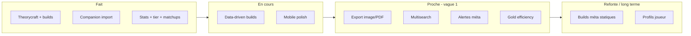

# Roadmap — Outils League of Legends (Lelanation v2)

> Dérivé de la Feature Map (Mai 2026), calibré sur l’état du dépôt `Lelanation_v2`.
> Référence projet : builder + stats + import client (companion).

## Légende

### Tags domaine (inchangés)

`#riot-api` · `#ia` · `#joueur-précis` · `#communautaire` · `#global` · `#data` · `#overlay` · `#esports` · `#mobile` · `#theorycraft`

### Tags statut (roadmap)

| Tag | Signification |
|-----|----------------|
| `fait` | Livré en v2 (code + usage réel ou quasi-complet) |
| `en-cours` | Travail actif ou pipeline déjà amorcé |
| `proche` | Prochaine vague : effort faible/moyen, aligné produit, peu de dépendances |
| `refonte` | Existe en v1, partiel, ou à reprendre proprement sur la stack v2 |
| `trop-loin` | Hors horizon court/moyen : concurrence saturée, coût énorme, ou hors ADN |

### Notation (source)

| Champ | Valeurs |
|-------|---------|
| **Difficulté** | 🟢 Facile · 🟡 Moyenne · 🔴 Difficile · 🔥 Très difficile |
| **Demande** | ⭐ Niche · ⭐⭐ Correcte · ⭐⭐⭐ Forte · ⭐⭐⭐⭐ Massive |
| **Temps** | Estimation indicative (jours → trimestres) |

### Score de priorité (`P`)

Utilisé pour **trier le backlog actif** (hors `fait` / `trop-loin`) :

```
P = (Demande × 10) + (Facilité × 6) − (Semaines mid) + BonusStatut

Demande   : ⭐=1 … ⭐⭐⭐⭐=4
Facilité  : 🟢=4, 🟡=3, 🔴=2, 🔥=1
Semaines  : milieu de la fourchette « Temps »
BonusStatut : en-cours +40 · proche +25 · refonte +5 · trop-loin −80
```

**Règle d’ordonnancement :** statut (`en-cours` → `proche` → `refonte`) puis **`P` décroissant**. Si deux items sont en `en-cours`, le plus haut `P` passe devant.

---

## Vue synthétique — Backlog priorisé

| P | Statut | Feature | Diff. | Demande |
|---|--------|---------|-------|---------|
| 89 | `en-cours` | Builds data-driven (winrate par variante) | 🔴 | ⭐⭐⭐⭐ |
| 86 | `en-cours` | Stats de champion (win/pick/ban + détail) | 🟡 | ⭐⭐⭐⭐ |
| 82 | `en-cours` | Version mobile vraiment utilisable | 🟡 | ⭐⭐⭐⭐ |
| 78 | `proche` | Export build PDF / image partageable | 🟢 | ⭐⭐ |
| 77 | `proche` | Multisearch (groupe Clash) | 🟢 | ⭐⭐⭐ |
| 76 | `proche` | Alertes / notifs changement de méta | 🟢 | ⭐⭐⭐ |
| 75 | `proche` | Gold efficiency calculator (theorycraft) | 🟡 | ⭐⭐ |
| 74 | `proche` | Comparateur de builds *(enrichir stats chiffrées)* | 🟢 | ⭐⭐⭐ |
| 73 | `proche` | Mode in-game quick ref (companion) | 🟡 | ⭐⭐⭐ |
| 72 | `proche` | Changelog de build par patch | 🟢 | ⭐⭐ |
| 71 | `proche` | Comments / reviews builds segmentés ELO | 🟢 | ⭐⭐ |
| 70 | `proche` | Partage build + replay lié | 🟡 | ⭐⭐ |
| 69 | `proche` | Breakpoints visuels sur le builder | 🟡 | ⭐⭐⭐ |
| 68 | `proche` | Leaderboards par champion / rang | 🟢 | ⭐⭐⭐ |
| 67 | `proche` | Patch notes tracker visuel | 🟡 | ⭐⭐ |
| 55 | `refonte` | Builds statiques par méta (reco items/runes) | 🟡 | ⭐⭐⭐⭐ |
| 54 | `refonte` | Guides écrits communauté (narratif) | 🟢 | ⭐⭐⭐ |
| 53 | `refonte` | Profils publics joueur | 🟡 | ⭐⭐⭐⭐ |
| 52 | `refonte` | Builds de pros en temps réel | 🟡 | ⭐⭐⭐ |
| 51 | `refonte` | Historique de méta / time machine | 🟡 | ⭐⭐ |
| 50 | `refonte` | Heat map de morts personnalisée | 🟡 | ⭐⭐⭐ |
| 49 | `refonte` | Tracker progression par champion | 🟡 | ⭐⭐⭐ |
| 48 | `refonte` | Courbe de puissance par temps de jeu | 🔴 | ⭐⭐⭐ |
| 12 | `trop-loin` | Overlay champ select | 🔴 | ⭐⭐⭐⭐ |
| 11 | `trop-loin` | Live game tracker | 🔴 | ⭐⭐⭐ |
| 10 | `trop-loin` | Prédiction de win pré-game (IA) | 🔴 | ⭐⭐⭐ |
| … | `trop-loin` | *Voir sections IA, Draft, Esports, Social avancé* | — | — |

---

## Réalisé (`fait`) — socle v2

Ces items ne sont **pas** dans le backlog actif ; ils ancrent le positionnement (builder + stats + companion).

| Feature | Indices dépôt | Tags |
|---------|-----------------|------|
| Builder interactif + theorycraft | `pages/builds/theorycraft.vue`, `Theorycraft*`, `theorycraftStats.ts` | `#theorycraft` `#global` |
| Création / édition / partage de builds | `pages/builds/create/*`, `shared/[id]`, `discover` | `#theorycraft` `#communautaire` |
| Comparateur de builds (base) | `pages/builds/compare.vue` | `#theorycraft` |
| Import builds dans le client LoL | `companion-app/`, `pages/lelanation-app.vue`, `POST /api/app/*` | `#overlay` `#theorycraft` |
| Stats agrégées (dashboard) | `pages/statistics/index.vue` (overview, team, objectives, bans, items, runes…) | `#data` `#global` `#riot-api` |
| Tier list | `pages/statistics/tier-list.vue` | `#data` `#global` |
| Matchups & détail champion | `pages/statistics/champion/[championId].vue` | `#data` `#global` |
| Collecte matchs + poller | `docs/riot-api-match-collection.md`, `logs/poller-v2-*`, PostgreSQL | `#data` `#riot-api` |
| Vidéos créateurs (YouTube) | `pages/videos/index.vue`, admin créateurs | `#communautaire` |
| Fiche champion + builds par champ | `pages/champions/[id].vue`, `builds/champion/[id].vue` | `#global` `#theorycraft` |
| Rendu carte build (partage visuel) | `pages/render/build-card.vue` | `#communautaire` `#theorycraft` |

---

## 🏗️ Build & Theorycraft

### Builds statiques par méta
Items, runes, sorts recommandés par rôle et patch, filtrables rang/région.  
`#global` `#data` `#riot-api` · Concurrents : u.gg, op.gg, lolalytics

| Statut | Difficulté | Demande | Temps | P |
|--------|------------|---------|-------|---|
| `refonte` | 🟡 Moyenne | ⭐⭐⭐⭐ Massive | 2–3 mois | 55 |

> Données match en place ; manque la couche « reco méta » type sites stats.

---

### Builds data-driven (winrate par variante)
Générés depuis des millions de parties ; winrate par ordre d’achat, variante item, rang.  
`#data` `#riot-api` `#global`

| Statut | Difficulté | Demande | Temps | P |
|--------|------------|---------|-------|---|
| `en-cours` | 🔴 Difficile | ⭐⭐⭐⭐ Massive | 3–6 mois | 89 |

> Pipeline ingestion + stats ; raffinements poller / agrégations en cours.

---

### Builds de pros en temps réel
Items/runes pros ou streamers, dernières parties.  
`#joueur-précis` `#riot-api` `#esports`

| Statut | Difficulté | Demande | Temps | P |
|--------|------------|---------|-------|---|
| `refonte` | 🟡 Moyenne | ⭐⭐⭐ Forte | 3–5 sem. | 52 |

---

### Builder interactif avec theorycraft
Interface build manuel, stats temps réel, partage.  
`#theorycraft` `#global` · **Créneau cœur Lelanation**

| Statut | Difficulté | Demande | Temps | P |
|--------|------------|---------|-------|---|
| `fait` | 🟡 Moyenne | ⭐⭐⭐ Forte | 1–2 mois | — |

---

### Guides écrits par la communauté
Builds narratifs, rotations, tips par phase.  
`#communautaire` `#global`

| Statut | Difficulté | Demande | Temps | P |
|--------|------------|---------|-------|---|
| `refonte` | 🟢 Facile | ⭐⭐⭐ Forte | 2–4 sem. | 54 |

> Builds + description existent ; pas le format « guide long » Mobafire.

---

### Simulateur de dégâts vs compo ennemie ⚡
5 champions adverses → build optimal pour *cette* compo.  
`#theorycraft` `#data` `#global`

| Statut | Difficulté | Demande | Temps | P |
|--------|------------|---------|-------|---|
| `trop-loin` | 🔴 Difficile | ⭐⭐⭐ Forte | 2–3 mois | 8 |

---

### Simulation de combat 1v1 ⚡
Deux champs, deux builds, early/mid/late.  
`#theorycraft` `#data` `#global`

| Statut | Difficulté | Demande | Temps | P |
|--------|------------|---------|-------|---|
| `trop-loin` | 🔥 Très difficile | ⭐⭐⭐ Forte | 3–6 mois | 2 |

---

### Gold efficiency calculator ⚡
Valeur stats / or, ratio coût/stats sur le builder.  
`#theorycraft` `#data`

| Statut | Difficulté | Demande | Temps | P |
|--------|------------|---------|-------|---|
| `proche` | 🟡 Moyenne | ⭐⭐ Correcte | 3–5 sem. | 75 |

> Stats theorycraft présentes ; calcul dédié gold-eff à formaliser.

---

### Breakpoints visuels ⚡
Seuils CDR, one-shot, etc. sur le builder.  
`#theorycraft` `#data`

| Statut | Difficulté | Demande | Temps | P |
|--------|------------|---------|-------|---|
| `proche` | 🟡 Moyenne | ⭐⭐⭐ Forte | 3–6 sem. | 69 |

---

### Courbe de puissance par temps de jeu ⚡
Graphe spike / faiblesse du build par minute.  
`#theorycraft` `#data`

| Statut | Difficulté | Demande | Temps | P |
|--------|------------|---------|-------|---|
| `refonte` | 🔴 Difficile | ⭐⭐⭐ Forte | 1–2 mois | 48 |

---

### Optimiseur automatique de build ⚡
Objectif (DPS, survie…) → build optimal budget or.  
`#ia` `#theorycraft` `#data`

| Statut | Difficulté | Demande | Temps | P |
|--------|------------|---------|-------|---|
| `trop-loin` | 🔥 Très difficile | ⭐⭐⭐ Forte | 3–6 mois | 3 |

---

### Comparateur de builds côte à côte ⚡
Deux builds, stats chiffrées DPS / tank / gold eff.  
`#theorycraft` `#global`

| Statut | Difficulté | Demande | Temps | P |
|--------|------------|---------|-------|---|
| `proche` | 🟢 Facile | ⭐⭐⭐ Forte | 2–4 sem. | 74 |

> Page compare existante ; enrichissement métriques theorycraft.

---

## 📊 Stats & Données

### Stats de champion (winrate, pickrate, banrate)
Données globales par rang, région, patch.  
`#data` `#global` `#riot-api`

| Statut | Difficulté | Demande | Temps | P |
|--------|------------|---------|-------|---|
| `en-cours` | 🟡 Moyenne | ⭐⭐⭐⭐ Massive | 1–2 mois | 86 |

> Livré fonctionnellement ; filtre rang/version et fraîcheur données encore en durcissement.

---

### Tier lists
Classement champions par force méta, par rôle.  
`#data` `#global`

| Statut | Difficulté | Demande | Temps | P |
|--------|------------|---------|-------|---|
| `fait` | 🟡 Moyenne | ⭐⭐⭐⭐ Massive | 3–6 sem. | — |

---

### Statistiques joueur (profil public)
Historique, KDA, pool, évolution rang.  
`#joueur-précis` `#riot-api`

| Statut | Difficulté | Demande | Temps | P |
|--------|------------|---------|-------|---|
| `refonte` | 🟡 Moyenne | ⭐⭐⭐⭐ Massive | 1–2 mois | 53 |

---

### Matchups & counters
Winrates matchup, items à prioriser.  
`#data` `#global`

| Statut | Difficulté | Demande | Temps | P |
|--------|------------|---------|-------|---|
| `fait` | 🟡 Moyenne | ⭐⭐⭐⭐ Massive | 1–2 mois | — |

---

### Multisearch
Plusieurs pseudos → stats groupe (Clash).  
`#joueur-précis` `#riot-api`

| Statut | Difficulté | Demande | Temps | P |
|--------|------------|---------|-------|---|
| `proche` | 🟢 Facile | ⭐⭐⭐ Forte | 1–2 sem. | 77 |

---

### Patch notes tracker visuel ⚡
Évolution stats champ/item patch par patch (graphe).  
`#data` `#global`

| Statut | Difficulté | Demande | Temps | P |
|--------|------------|---------|-------|---|
| `proche` | 🟡 Moyenne | ⭐⭐ Correcte | 3–6 sem. | 67 |

> Trends partiels sur fiche champion ; généraliser.

---

### Historique de méta / time machine ⚡
Méta conseillée patch par patch.  
`#data` `#global`

| Statut | Difficulté | Demande | Temps | P |
|--------|------------|---------|-------|---|
| `refonte` | 🟡 Moyenne | ⭐⭐ Correcte | 1–2 mois | 51 |

---

### Leaderboards par champion ou rang
Classements mondiaux / régionaux.  
`#data` `#global` `#riot-api`

| Statut | Difficulté | Demande | Temps | P |
|--------|------------|---------|-------|---|
| `proche` | 🟢 Facile | ⭐⭐⭐ Forte | 2–4 sem. | 68 |

---

## 🔴 Live / In-Game

### Overlay champ select
Rang, winrate, picks en champ select.  
`#overlay` `#joueur-précis` `#riot-api`

| Statut | Difficulté | Demande | Temps | P |
|--------|------------|---------|-------|---|
| `trop-loin` | 🔴 Difficile | ⭐⭐⭐⭐ Massive | 2–4 mois | 12 |

---

### Import automatique de builds dans le client
Runes et items en un clic.  
`#overlay` `#theorycraft`

| Statut | Difficulté | Demande | Temps | P |
|--------|------------|---------|-------|---|
| `fait` | 🟡 Moyenne | ⭐⭐⭐⭐ Massive | 2–4 sem. | — |

---

### Live game tracker
Gold diff, objectifs, timeline en direct.  
`#overlay` `#riot-api` `#joueur-précis`

| Statut | Difficulté | Demande | Temps | P |
|--------|------------|---------|-------|---|
| `trop-loin` | 🔴 Difficile | ⭐⭐⭐ Forte | 2–3 mois | 11 |

---

### Prédiction de win avant la game ⚡
Score probabilité victoire (10 joueurs, historiques).  
`#ia` `#data` `#joueur-précis` `#riot-api`

| Statut | Difficulté | Demande | Temps | P |
|--------|------------|---------|-------|---|
| `trop-loin` | 🔴 Difficile | ⭐⭐⭐ Forte | 2–4 mois | 10 |

---

### Mode in-game quick ref ⚡
Vue 5 s : ordre d’achat, runes, tip matchup.  
`#overlay` `#mobile`

| Statut | Difficulté | Demande | Temps | P |
|--------|------------|---------|-------|---|
| `proche` | 🟡 Moyenne | ⭐⭐⭐ Forte | 3–5 sem. | 73 |

> Extension naturelle du companion (déjà import + sync match).

---

## 📈 Progression & Coaching

### Analyse de gameplay personnalisée
Vision, CS/min, deaths évitables depuis l’historique.  
`#ia` `#joueur-précis` `#riot-api`

| Statut | Difficulté | Demande | Temps | P |
|--------|------------|---------|-------|---|
| `trop-loin` | 🔴 Difficile | ⭐⭐⭐ Forte | 3–6 mois | 9 |

---

### Coach IA in-game
Conseils temps réel ou post-game.  
`#ia` `#overlay` `#joueur-précis`

| Statut | Difficulté | Demande | Temps | P |
|--------|------------|---------|-------|---|
| `trop-loin` | 🔥 Très difficile | ⭐⭐⭐ Forte | 6+ mois | 1 |

---

### Heat map de morts personnalisé ⚡
Où *toi* tu meurs (pas stats globales champ).  
`#joueur-précis` `#riot-api` `#data`

| Statut | Difficulté | Demande | Temps | P |
|--------|------------|---------|-------|---|
| `refonte` | 🟡 Moyenne | ⭐⭐⭐ Forte | 1–2 mois | 50 |

---

### Tracker d'objectifs personnels ⚡
Baron / Drake / Herald vs wins.  
`#joueur-précis` `#riot-api` `#data`

| Statut | Difficulté | Demande | Temps | P |
|--------|------------|---------|-------|---|
| `proche` | 🟡 Moyenne | ⭐⭐ Correcte | 3–6 sem. | 64 |

---

### Analyse de warding ⚡
Spots de ward vs méta, corrélation résultats.  
`#joueur-précis` `#riot-api` `#data`

| Statut | Difficulté | Demande | Temps | P |
|--------|------------|---------|-------|---|
| `trop-loin` | 🔴 Difficile | ⭐ Niche | 2–3 mois | 5 |

---

### Tracker de progression par champion ⚡
KDA / winrate dans le temps, erreurs récurrentes.  
`#joueur-précis` `#riot-api` `#data`

| Statut | Difficulté | Demande | Temps | P |
|--------|------------|---------|-------|---|
| `refonte` | 🟡 Moyenne | ⭐⭐⭐ Forte | 1–2 mois | 49 |

---

### « Pourquoi j'ai perdu cette partie ? » ⚡
Explication narrative automatique.  
`#ia` `#joueur-précis` `#riot-api`

| Statut | Difficulté | Demande | Temps | P |
|--------|------------|---------|-------|---|
| `trop-loin` | 🔥 Très difficile | ⭐⭐⭐ Forte | 4–6 mois | 2 |

---

### IA qui analyse les replays .rofl ⚡
Positioning, retraites, patterns teamfight.  
`#ia` `#joueur-précis`

| Statut | Difficulté | Demande | Temps | P |
|--------|------------|---------|-------|---|
| `trop-loin` | 🔥 Très difficile | ⭐⭐⭐ Forte | 6+ mois | 0 |

---

## 🎯 Draft & Teamplay

### Simulateur de draft (champ select)
Draft 5v5, ban/pick, synergies compo.  
`#data` `#global` `#communautaire`

| Statut | Difficulté | Demande | Temps | P |
|--------|------------|---------|-------|---|
| `trop-loin` | 🔴 Difficile | ⭐⭐⭐ Forte | 2–4 mois | 7 |

---

### Build collaboratif en temps réel ⚡
Équipe construit compo/build avant Clash.  
`#communautaire` `#theorycraft`

| Statut | Difficulté | Demande | Temps | P |
|--------|------------|---------|-------|---|
| `trop-loin` | 🟡 Moyenne | ⭐⭐ Correcte | 1–2 mois | 18 |

---

### Clash / team tools ⚡
Compo, dispos, historique commun.  
`#communautaire` `#riot-api`

| Statut | Difficulté | Demande | Temps | P |
|--------|------------|---------|-------|---|
| `trop-loin` | 🟡 Moyenne | ⭐⭐⭐ Forte | 1–2 mois | 15 |

> Multisearch + partage builds = prérequis plus légers à traiter en `proche` d’abord.

---

## 👥 Social & Communauté

### Profils publics de joueur
Page partageable stats / pool / historique.  
`#joueur-précis` `#riot-api` `#communautaire`

| Statut | Difficulté | Demande | Temps | P |
|--------|------------|---------|-------|---|
| `refonte` | 🟡 Moyenne | ⭐⭐⭐⭐ Massive | 1–2 mois | 53 |

---

### Duo / team finder
Coéquipiers compatibles.  
`#communautaire` `#joueur-précis` `#riot-api`

| Statut | Difficulté | Demande | Temps | P |
|--------|------------|---------|-------|---|
| `trop-loin` | 🟡 Moyenne | ⭐⭐⭐ Forte | 1–2 mois | 14 |

---

### Find my teammates by playstyle ⚡
Matcher agressif/passif, early/late, pools complémentaires.  
`#ia` `#communautaire` `#joueur-précis` `#riot-api`

| Statut | Difficulté | Demande | Temps | P |
|--------|------------|---------|-------|---|
| `trop-loin` | 🔴 Difficile | ⭐⭐⭐ Forte | 3–4 mois | 6 |

---

### Partage de build + replay lié ⚡
Build + game qui le prouve.  
`#communautaire` `#joueur-précis` `#riot-api`

| Statut | Difficulté | Demande | Temps | P |
|--------|------------|---------|-------|---|
| `proche` | 🟡 Moyenne | ⭐⭐ Correcte | 3–5 sem. | 70 |

> Companion envoie déjà `matchId` + région ; lien UX à construire.

---

### Comments / reviews de builds segmentés par ELO ⚡
Notes par rang du reviewer.  
`#communautaire` `#joueur-précis`

| Statut | Difficulté | Demande | Temps | P |
|--------|------------|---------|-------|---|
| `proche` | 🟢 Facile | ⭐⭐ Correcte | 2–4 sem. | 71 |

---

### Challenges communautaires ⚡
Défis off-meta, gamification theorycraft.  
`#communautaire` `#global`

| Statut | Difficulté | Demande | Temps | P |
|--------|------------|---------|-------|---|
| `trop-loin` | 🟡 Moyenne | ⭐⭐ Correcte | 1–2 mois | 17 |

---

### « Quel champion dois-je apprendre ? » ⚡
Style + pool + méta → reco perso.  
`#ia` `#joueur-précis` `#riot-api`

| Statut | Difficulté | Demande | Temps | P |
|--------|------------|---------|-------|---|
| `trop-loin` | 🔴 Difficile | ⭐⭐⭐ Forte | 2–3 mois | 4 |

---

## 🎨 Cosmétiques & Collection

### Skins viewer / collection tracker
Skins par champion, possession, comparaison.  
`#global` `#joueur-précis`

| Statut | Difficulté | Demande | Temps | P |
|--------|------------|---------|-------|---|
| `trop-loin` | 🟢 Facile | ⭐⭐ Correcte | 2–4 sem. | 20 |

> Hors ADN actuel (pas de monétisation collection).

---

## 🏆 Esports

### Suivi résultats & standings esports
LEC/LCK/LPL/LCS, brackets.  
`#esports` `#global`

| Statut | Difficulté | Demande | Temps | P |
|--------|------------|---------|-------|---|
| `trop-loin` | 🟡 Moyenne | ⭐⭐⭐ Forte | 1–2 mois | 13 |

---

### Builds de pros en live (match officiel) ⚡
Build pro pendant LEC/LCK.  
`#esports` `#data` `#joueur-précis`

| Statut | Difficulté | Demande | Temps | P |
|--------|------------|---------|-------|---|
| `trop-loin` | 🔴 Difficile | ⭐⭐ Correcte | 2–4 mois | 5 |

---

### Fantasy LoL / pronostics esports ⚡
Fantasy / paris (mode Riot abandonné).  
`#esports` `#communautaire`

| Statut | Difficulté | Demande | Temps | P |
|--------|------------|---------|-------|---|
| `trop-loin` | 🔴 Difficile | ⭐⭐ Correcte | 3–4 mois | 4 |

---

## 📱 UX / Platform

### Version mobile vraiment utilisable ⚡
Build entre deux games sur téléphone.  
`#mobile` `#global`

| Statut | Difficulté | Demande | Temps | P |
|--------|------------|---------|-------|---|
| `en-cours` | 🟡 Moyenne | ⭐⭐⭐⭐ Massive | 1–2 mois | 82 |

> Mobile-first au niveau projet ; polish parcours builds/stats en cours.

---

### Export build en PDF / image partageable ⚡
Build formaté pour Discord.  
`#communautaire` `#theorycraft`

| Statut | Difficulté | Demande | Temps | P |
|--------|------------|---------|-------|---|
| `proche` | 🟢 Facile | ⭐⭐ Correcte | 1–2 sem. | 78 |

> `render/build-card` = base ; PDF + UX export à finaliser.

---

### Changelog de build ⚡
Évolution d’un build patch par patch.  
`#data` `#theorycraft`

| Statut | Difficulté | Demande | Temps | P |
|--------|------------|---------|-------|---|
| `proche` | 🟢 Facile | ⭐⭐ Correcte | 2–3 sem. | 72 |

---

### Alertes / notifs changement de méta ⚡
Push / mail après patch (nerf Jinx, etc.).  
`#data` `#riot-api` `#joueur-précis`

| Statut | Difficulté | Demande | Temps | P |
|--------|------------|---------|-------|---|
| `proche` | 🟢 Facile | ⭐⭐⭐ Forte | 2–4 sem. | 76 |

---

## 🤖 IA / Data avancé

### Build méta-agnostique ⚡
Build pour *contrer* la méta, pas la suivre.  
`#ia` `#theorycraft` `#data`

| Statut | Difficulté | Demande | Temps | P |
|--------|------------|---------|-------|---|
| `trop-loin` | 🔥 Très difficile | ⭐⭐ Correcte | 4–6 mois | 6 |

---

### Intégration VOD + stats ⚡
Sync Twitch/YouTube avec timeline gold/kills/objectifs.  
`#ia` `#data` `#joueur-précis` `#esports`

| Statut | Difficulté | Demande | Temps | P |
|--------|------------|---------|-------|---|
| `trop-loin` | 🔥 Très difficile | ⭐⭐⭐ Forte | 6+ mois | 0 |

---

## Jalons suggérés (ordre d’exécution)



| Vague | Horizon | Focus |
|-------|---------|--------|
| **A** | En cours | Data-driven builds, fraîcheur stats, mobile |
| **B** | 2–6 sem. | Export, multisearch, alertes, gold eff, compare enrichi |
| **C** | 1–2 mois | Breakpoints, quick ref companion, partage build+match |
| **D** | Refonte | Méta statique, profils, guides narratifs, time machine |
| **E** | `trop-loin` | Overlay, IA coaching, draft sim, VOD, esports live |

---

## Maintenance

- **Recalibrer** les tags `fait` / `en-cours` à chaque epic livrée (voir `_bmad-output/planning-artifacts/epics.md`).
- **Recalculer `P`** si la demande ou la difficulté change (feedback utilisateurs, limites Riot API).
- Source feature map d’origine : document utilisateur « Feature Map — Outils LoL » (Mai 2026).

*Dernière mise à jour : Mai 2026 — généré depuis l’état du dépôt Lelanation_v2.*
