# Schéma DB — `lelanation_statistiques`

Ce document décrit le schéma **réel** de la base PostgreSQL utilisée par le poller v2.

Sources de vérité :
- `backend/drizzle/migrations/0001_statistiques_partition_by_patch.sql`
- migrations incrémentales `0002` à `0018`

---

## Vue d'ensemble

- Base orientée **agrégats statistiques LoL** (pas un modèle OLTP classique).
- Presque toutes les tables d’agrégats sont **partitionnées par `patch`** (`PARTITION BY LIST (patch)` + partition `*_p_default`).
- Très peu de clés étrangères explicites : les relations sont surtout **logiques** (par IDs Riot + dimensions communes).
- Dimensions communes quasi systématiques :
  - `patch`
  - `rank_tier`
  - `region`
  - parfois `role`, `champion_id`, `team`

---

## ERD simplifié (logique)

```mermaid
erDiagram
  players {
    varchar puuid PK
    text region
    timestamptz last_seen
  }

  player_rank_history {
    varchar puuid PK
    date date PK
    text region PK
    text rank_tier
    text rank_division
    smallint rank_lp
  }

  processed_matches {
    text patch PK
    text riot_match_id PK
    date game_date
    text status
    text rank
    text participant1_puuid
    text participant1_game_name
    text participant1_tag_name
  }

  champion_stats {
    text patch PK
    text role PK
    text rank_tier PK
    text region PK
    int champion_id PK
    smallint team PK
    int count_game
    int count_win
  }

  champion_vs_stats {
    text patch PK
    text role PK
    text rank_tier PK
    text region PK
    int champion_id PK
    int opponent_champion_id PK
    int count_game
    int count_win
  }

  champion_spell_stats {
    text patch PK
    text role PK
    text rank_tier PK
    text region PK
    int champion_id PK
    text spell_order_hash PK
    text spell_order
  }

  champion_item_solo_stats {
    text patch PK
    text role PK
    text rank_tier PK
    text region PK
    int champion_id PK
    int item_id PK
  }

  champion_item_set_stats {
    text patch PK
    text role PK
    text rank_tier PK
    text region PK
    int champion_id PK
    text phase PK
    text item_set_key PK
  }

  champion_runes_stats {
    text patch PK
    text role PK
    text rank_tier PK
    text region PK
    int champion_id PK
    text rune_list PK
    text shard_list PK
  }

  champion_runes_solo_stats {
    text patch PK
    text role PK
    text rank_tier PK
    text region PK
    int champion_id PK
    int perk_id PK
  }

  champion_shard_solo_stats {
    text patch PK
    text role PK
    text rank_tier PK
    text region PK
    int champion_id PK
    int shard_id PK
    smallint slot PK
  }

  champion_summoner_spells {
    text patch PK
    text role PK
    text rank_tier PK
    text region PK
    int champion_id PK
    int spell_id PK
  }

  champion_summoner_spell_pair_stats {
    text patch PK
    text role PK
    text rank_tier PK
    text region PK
    int champion_id PK
    int spell_d PK
    int spell_f PK
  }

  champion_tier_daily_snapshots {
    text patch PK
    text role PK
    text rank_tier PK
    text region PK
    int champion_id PK
    date date_of_game PK
    int games
    int wins
    int count_ban
  }

  item_tier_daily_snapshots {
    text patch PK
    text rank_tier PK
    text region PK
    int item_id PK
    date date_of_game PK
    int games
    int wins
    jsonb order
    bigint sum_achat_tmps
    int top_game
    int top_win
    int jungle_game
    int jungle_win
    int mid_game
    int mid_win
    int adc_game
    int adc_win
    int support_game
    int support_win
  }

  champion_bans_by_banner {
    text patch PK
    text rank_tier PK
    text region PK
    int banned_champion_id PK
  }

  team_core_stat {
    text patch PK
    text rank_tier PK
    text region PK
    smallint team PK
  }

  objective_outcome_histogram {
    text patch PK
    text rank_tier PK
    text region PK
    smallint team PK
    text objective_type PK
    text type_drake_key PK
    boolean is_soul PK
    text outcome PK
    smallint obj_count PK
  }

  match_outcome_stats {
    text patch PK
    text rank_tier PK
    int count_match
  }

  champion_duo_role_stats ||--|| champion_stats : "same dims + ally_champion_id"
  botlane_duo_vs_duo_stats ||--|| champion_stats : "same dims + duo ids"
  champion_vs_stats ||--|| champion_stats : "same dims + opponent"
  players ||--o{ player_rank_history : "puuid"
  players ||--o{ processed_matches : "rank fill / discovery"
```

---

## Tables coeur ingestion & tracking

### `players`
- PK: `puuid`
- Rôle: pool joueurs connus pour discovery/rank-fill.
- Colonnes actives principales: `puuid`, `region`, `last_seen`, `puuid_key_version`, `created_at`, `updated_at`.
- Notes:
  - `game_name`, `tag_name`, champs rank snapshot retirés par migration `0005`.
  - Index ajoutés par `0014`:
    - `idx_players_last_seen_desc`
    - `idx_players_last_seen_asc_nulls_first`

### `player_rank_history`
- PK: `(puuid, date, region)`
- Rôle: historique quotidien du rank joueur.
- Index:
  - `idx_rank_history_lookup (puuid, region, date DESC)`

### `processed_matches` *(partitionnée par patch)*
- PK: `(patch, riot_match_id)`
- Rôle: suivi ingestion match (pending/done/error + rang match).
- Colonnes clés: `patch`, `riot_match_id`, `game_date`, `status`, `rank`, `created_at`.
- Participants (migration `0016`) — pour chaque slot `1` à `10` :
  - `participant{n}_puuid` (`TEXT`, nullable)
  - `participant{n}_game_name` (`TEXT`, nullable)
  - `participant{n}_tag_name` (`TEXT`, nullable)
- Migrations:
  - `0006`: suppression colonnes `aggregate_*`
  - `0007`: `rank` converti en `TEXT`
  - `0016`: colonnes `participant{1..10}_{puuid,game_name,tag_name}`

---

## Tables agrégées champion / build / runes / spells

Toutes ces tables sont partitionnées par `patch`.

- `champion_stats`  
  Agrégat principal par `(patch, role, rank_tier, region, champion_id, team)`.
- `champion_vs_stats`  
  Matchups champion vs champion.
- `champion_duo_role_stats`  
  Synergies champion + allié.
- `botlane_duo_vs_duo_stats`  
  Matchup duo bot `(adc/support vs opp_adc/opp_support)`.
- `champion_item_solo_stats`  
  Fréquences/winrate item unitaire.
- `champion_item_set_stats`  
  Sets d’items (`starter/core/final`).
- `champion_runes_stats` / `champion_runes_solo_stats`  
  Combinaisons runes + usage rune unitaire.
- `champion_shard_solo_stats`  
  Shards unitaires par slot.
- `champion_summoner_spells` / `champion_summoner_spell_pair_stats`  
  Sorts d’invocateur solo/paires.
- `champion_spell_stats`  
  Ordres de montée de sorts.
  - Migration `0003`: PK basée sur `spell_order_hash = md5(spell_order)` (évite limite btree).
- `champion_tier_daily_snapshots`  
  Snapshots journaliers pour tiers et tendances.

Indexes notables :
- `idx_champion_tier_snapshot_champ`
- `idx_champion_tier_snapshot_tier`
- `idx_champion_vs_dims`
- `idx_item_tier_snapshot_item`
- `idx_item_tier_snapshot_tier`

---

## Tables agrégées objectifs / team / outcomes

- `team_core_stat`  
  Agrégat équipe (100/200): games, wins, surrender counts.
- `objective_outcome_histogram`  
  Histogrammes d’objectifs par outcome.
  - Migration `0013`:
    - ajout `is_soul`, `type_drake`, `type_drake_key`
    - PK élargie: `(patch, rank_tier, region, team, objective_type, type_drake_key, is_soul, outcome, obj_count)`
    - check `objective_outcome_histogram_drake_cols_chk`
    - index `objective_outcome_histogram_dragon_idx`
- `match_outcome_stats`  
  Compteur de matchs par `(patch, rank_tier[, region selon migration])`.

---

## Tables bans & snapshots

- `item_tier_daily_snapshots` *(migrations `0016`–`0018`, partitionnée par `patch` ; compteurs par rôle `top_*`, `jungle_*`, `mid_*`, `adc_*`, `support_*`)*
  - PK: `(patch, rank_tier, region, item_id, date_of_game)`
  - Rôle: tendances item par patch / tier / région / jour (patch notes tracker).
  - Colonnes: `games`, `wins`, `"order"` (JSONB — clé = ordre d'achat sérialisé, valeur = nombre de wins), `sum_achat_tmps` (somme des timestamps ms d'achat pour timing moyen).
- `champion_bans_by_banner`
  - PK: `(patch, rank_tier, region, banned_champion_id)`
  - Migration `0004`: `banned_champion_id` en `INTEGER`
  - Migration `0010`: colonnes outcome
    - `count_ban_when_team_won`
    - `count_ban_when_team_lost`
  - Backfill historique via `0011`.

---

## Partitionnement & conventions

- Stratégie: `LIST (patch)` sur les tables d’agrégats.
- Chaque table partitionnée a une partition fallback `*_p_default`.
- Objectif:
  - isolation par patch
  - maintenance/perf meilleure sur gros volumes
  - purge ciblée par patch possible

---

## Fonction SQL utilitaire

- `set_updated_at()` (trigger function PL/pgSQL)
  - définit `updated_at = NOW()` au `UPDATE`
  - disponible depuis les migrations de base

---

## Limites connues du schéma

- Peu/pas de FK physiques entre tables (intentionnel pour ingestion perf).
- Cohérence inter-table portée par le pipeline applicatif.
- Certaines docs anciennes mentionnent des tables Prisma `matches/participants` non présentes dans ce schéma Drizzle.

---

## Références docs

- [Accès à la base de données](./database-access.md)
- [Calculs des statistiques](./stats-calculations.md)
- [Audit des formules de stats](./stats-formulas-audit.md)
- [Riot API – Collecte de matchs](./riot-api-match-collection.md)
