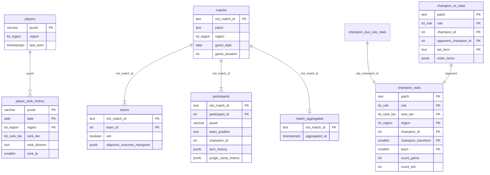

# Schéma DB — `lelanation_statistiques`

Ce document décrit le schéma **réel** de la base PostgreSQL utilisée par le poller v2 et le backend stats.

Sources de vérité :
- `backend/drizzle/migrations/0000_lelanation_statistiques.sql`
- `backend/drizzle/migrations/0001_statistiques_partition_by_patch.sql`
- migrations incrémentales `0002` à `0038`

---

## Vue d'ensemble

- Base orientée **agrégats statistiques LoL** + **stockage normalisé des matchs** (ingestion poller).
- Les tables d’agrégats sont **partitionnées par `patch`** (`PARTITION BY LIST (patch)` + partition `*_p_default`).
- Les tables normalisées (`matchs`, `teams`, `participants`) ne sont **pas** partitionnées ; elles conservent les matchs ingérés.
- Peu de clés étrangères sur les agrégats (intentionnel) ; FK explicites sur le modèle normalisé (`teams` / `participants` → `matchs`).
- Dimensions communes des agrégats :
  - `patch` (`TEXT`)
  - `rank_tier` (`lol_rank_tier`)
  - `region` (`lol_region`)
  - souvent `role` (`lol_role`), `champion_id`, `champion_transform`, `team`

### Pipeline données

```
Poller → matchs / teams / participants (normalisé)
       → ingestion worker (players, player_rank_history)
       → match batch aggregation (30 min) → tables champion_* / team_core_stat / …
       → match_aggregated (marqueur « déjà agrégé »)
```

---

## Types enum PostgreSQL

Introduits par `0037_lol_enum_types` / `0038_finalize_lol_enums`.

| Type | Valeurs |
|------|---------|
| `lol_role` | `TOP`, `JUNGLE`, `MIDDLE`, `BOTTOM`, `UTILITY` |
| `lol_rank_tier` | `IRON` … `CHALLENGER`, `UNRANKED` |
| `lol_region` | `EUW1`, `EUN1`, `NA1`, `KR`, `BR1`, `LA1`, `LA2`, `OC1`, `TR1`, `JP1`, `ME1` |

**Mapping applicatif** (API / Riot → DB) :
- `MID` → `MIDDLE`, `ADC` / `BOT` → `BOTTOM`, `SUPPORT` → `UTILITY`
- alias région (`euw`, `na`, …) → codes platform (`EUW1`, `NA1`, …)

Les colonnes `role`, `rank_tier`, `region` des tables d’agrégats et de `matchs` / `player_rank_history` utilisent ces enums (plus de `TEXT` libre).

---

## ERD simplifié (logique)



---

## Tables normalisées (ingestion)

Migration `0025_normalized_match_tables` (+ évolutions `0027`–`0036`).

### `matchs`
- PK : `riot_match_id`
- Colonnes : `patch`, `region` (`lol_region`), `queue_id`, `game_date`, `early_surrender`, `surrender`, `game_duration`, `created_at`
- Index : `(patch, game_date)`, `region`, `created_at`
- Plus de colonnes JSON match/timeline (`0027`)

### `teams`
- PK : `(riot_match_id, team_id)` — FK → `matchs` ON DELETE CASCADE
- Objectifs équipe (baron, dragon, tours, …), drakes par type, soul, `objective_outcome_histogram` (JSONB)

### `participants`
- PK : `(riot_match_id, participant_id)` — FK → `matchs` ON DELETE CASCADE
- Identité : `puuid`, `riot_id_*`, `team_id`, `team_position`, `champion_id`, `champion_transform`, `transform_timestamp_ms`
- Stats Riot + challenges (colonnes scalaires, ~200 champs)
- **Historiques JSONB** : `item_history`, `spell_history`, `kill_history`, `death_history`, `assist_history`, `ward_history`, `ward_killed_history`
- **Buckets timeline** (tableaux `INTEGER[]`, fenêtres 5 min) : `gold_buckets`, `cs_buckets`, `level_buckets`, `xp_buckets`, `kill_*`, `death_*`, `jungle_buckets`, dégâts phys/mag/true (+ taken), `ward_placed_buckets`, `ward_killed_buckets`, `cc_time_buckets`, `gold_spent_buckets`, `turret_damage_buckets`, `objective_damage_buckets`
- **`jungle_camp_history`** (JSONB, défaut `{"camps":[],"early_path":null}`) :
  - `camps` : liste `{ camp, timestamp_ms }`
  - `early_path` : `{ path_sequence, path_hash, clear_time_ms }` (jungler, migration `0036`)
- Colonnes retirées : `vision_buckets`, `damage_self_mitigated_buckets`, `shield_and_heal_*` (`0033`), `jungle_path_*` (`0036`)

### `match_aggregated`
- PK : `riot_match_id`
- Une ligne = match **déjà passé** par l’agrégation batch (`0026` : plus de file `aggregated = false`)
- Colonnes : `aggregated` (bool, défaut `true` en pratique), `aggregated_at`

---

## Tables coeur joueurs & rangs

### `players`
- PK : `puuid`
- Rôle : pool joueurs pour discovery / rank-fill
- Colonnes : `region` (`lol_region`), `last_seen`, `puuid_key_version`, `created_at`, `updated_at`
- Index (`0014`) : `last_seen` ASC/DESC

### `player_rank_history`
- PK : `(puuid, date, region)`
- Snapshot quotidien : `rank_tier` (`lol_rank_tier`), `rank_division`, `rank_lp`
- Index : `idx_rank_history_lookup (puuid, region, date DESC)`
- Utilisé pour réhydrater les rangs avant agrégation batch

---

## Tables agrégées champion / build / runes / spells

Toutes partitionnées par `patch`. PK inclut `champion_transform` depuis `0022` (formes Kayn, etc.).

| Table | Clé / rôle |
|-------|------------|
| `champion_stats` | `(patch, role, rank_tier, region, champion_id, champion_transform, team)` — agrégat principal |
| `champion_vs_stats` | + `opponent_champion_id`, `set_item` ; `order_items` JSONB ; métriques lane U15 (`0024`) |
| `champion_duo_role_stats` | + `ally_champion_id`, `ally_role` |
| `botlane_duo_vs_duo_stats` | duo bot vs duo adverse |
| `champion_item_solo_stats` | par `item_id` |
| `champion_item_set_stats` | par `phase`, `item_set_key` |
| `champion_runes_stats` / `champion_runes_solo_stats` | combinaisons / rune unitaire |
| `champion_shard_solo_stats` | par `shard_id`, `slot` |
| `champion_summoner_spells` / `champion_summoner_spell_pair_stats` | sorts invocateur |
| `champion_spell_stats` | `spell_order_hash` = md5(`spell_order`) (`0003`) |
| `champion_pick_order` | ordre de pick draft |
| `champion_bucket` | stats par `duration_bucket` + `transform_timestamp_ms` |
| `champion_tier_daily_snapshots` | tendances journalières (`date_of_game`) |

Métriques : centaines de colonnes `count_*` / `sum_*` (challenges Riot, objectifs, lane, etc.). Plusieurs `sum_*` challenges en `DOUBLE PRECISION` (`0008`).

---

## Tables objectifs / équipe / outcomes

| Table | Rôle |
|-------|------|
| `team_core_stat` | agrégat équipe 100/200 (surrenders, wins, …) |
| `objective_outcome_histogram` | histogrammes objectifs ; PK avec `type_drake_key`, `is_soul` (`0013`) |
| `match_outcome_stats` | compteur matchs par `(patch, rank_tier)` ; colonne `region` présente mais hors PK |

---

## Bans & snapshots items

### `champion_bans_by_banner`
- PK : `(patch, rank_tier, region, banned_champion_id)`
- `banned_champion_id` en `INTEGER` (`0004`)
- Outcomes ban (`0010`) : `count_ban_when_team_won`, `count_ban_when_team_lost`

### `item_tier_daily_snapshots`
- PK : `(patch, rank_tier, region, item_id, date_of_game)`
- Compteurs par rôle : `top_*`, `jungle_*`, `mid_*`, `adc_*`, `support_*` (`0018`)
- `"order"` JSONB (ordre d’achat → wins), `sum_achat_tmps`

---

## Patch notes

### `patch_notes_stats` (`0021`)
- PK : `(type_cible, id_cible, game_version)`
- `type_cible` : `champion` | `items` | `runes`
- Compteurs : `count_nerf`, `count_up`, `count_ajust`

---

## Tables supprimées (ne plus documenter / utiliser)

| Migration | Tables / colonnes |
|-----------|-------------------|
| `0028` | `processed_matches`, `obs_*` (observabilité SQL → fichier Redis/JSON) |
| `0034` | `ward_heatmap_delta`, `agg_ward_heatmap`, `position_heatmap_delta`, `agg_position_heatmap`, `aggregation_cursor` |
| `0035` | `jungle_path_delta`, `agg_jungle_path` |

---

## Partitionnement & conventions

- Stratégie agrégats : `LIST (patch)` + partition fallback `*_p_default`
- Purge / archivage ciblé par patch possible côté ops
- Trigger `set_updated_at()` sur plusieurs tables agrégées

---

## Agrégation & rangs

- L’agrégation batch lit `matchs` / `participants` / `teams` et upsert dans les tables `champion_*`
- `match_aggregated` évite de ré-agréger un match déjà traité
- Rang participant : snapshot `player_rank_history` à la `game_date` (best-effort at-or-after) ; si manquant → jobs `fetch-rank` BullMQ, puis retry batch
- `rank_tier` match = moyenne des rangs classés connus ; fallback `UNRANKED` si aucun classé

---

## Limites connues

- Cohérence inter-tables agrégats portée par le pipeline applicatif (peu de FK).
- `participants` : colonnes très nombreuses ; évolution via migrations Drizzle dédiées.
- Fixtures de référence API : `backend/data/api-riot/*.json` (rafraîchies une fois par patch via Data Dragon sync).

---

## Références

- [Accès à la base de données](./database-access.md)
- [Calculs des statistiques](./stats-calculations.md)
- [Audit des formules de stats](./stats-formulas-audit.md)
- [Riot API – Collecte de matchs](./riot-api-match-collection.md)
- [Poller & ingestion](./db-poller-et-ingestion.md)
